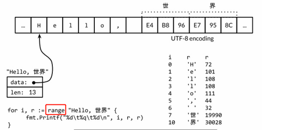
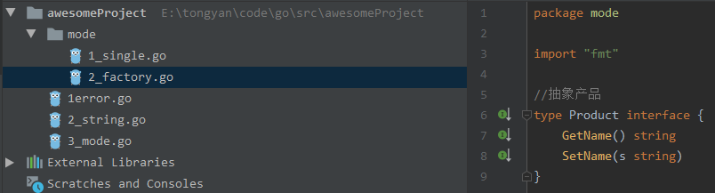
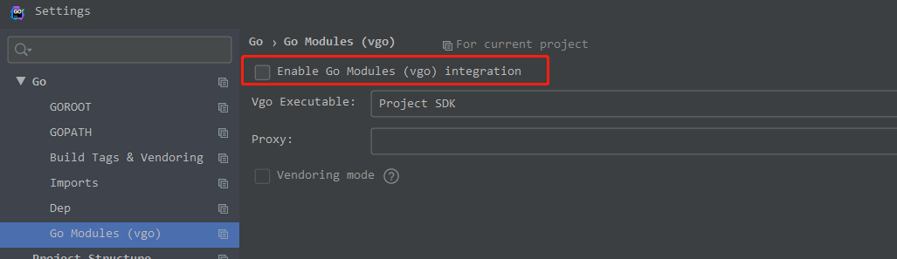

# go学习笔记

# 字符串

字符串是不可修改的字节序列，底层通过byte数组实现。用双引号包裹，尝试修改字符串内部数据的操作也是被禁止的。

s := "a"

S [0] = ‘q’  //compile error

编码发展：ASCII(1byte) -> Unicode(4byte) -> utf8(1~4byte)

go源文件使用utf8编码


## 格式转换

任意类型都可以强转成string类型

对中文字符串进行操作时，有时转成[]rune类型比较方便，

> 字符串和字节slice相互转换

```go
s := "abc"
b := []byte(s)
s2 := string(b)
fmt.Printf("%#v\t%T\n", s, s)     // "abc" string
fmt.Printf("%#v\t%T\n", b, b)     // []byte{0x61, 0x62, 0x63} []uint8
fmt.Printf("%#v\t%T\n", s2, s2)   // "abc" string
```


> 字符串和[]rune转换

```go
s := "中国"
r := []rune(s)
s2 := string(r)
fmt.Printf("%#v\t%v\t%T\n", s, len(s), s)      //"中国"  6   string
fmt.Printf("%#v\t%v\t%T\n", r, len(r), r)     //[]int32{20013, 22269} 2 []int32
fmt.Printf("%#v\t%T\n", s2, s2)             //"中国"     string
fmt.Printf("r[0]: %v,string(r[0]): %v", r[0], string(r[0]))   //r[0]:20013,string(r[0]):中
```


## 字符

字符串中的每一个元素叫做“字符”，在遍历或者单个获取字符串元素时可以获得字符。

字符有以下两种：

byte：实际是uint8类型，，代表了 [ASCII](http://c.biancheng.net/c/ascii/) 码的一个字符。

rune：实际是int32类型，通常用于处理Unicode码中文等复合字符

```go
var a byte = 'a'
fmt.Printf("%d %T\n", a, a) //97 uint8
//var a byte = '你'  //constant 20320 overflows byte

var b rune = '你'
fmt.Printf("%d %T\n", b, b) //20320 int32
```

## 编码与字符集

Unicode是一种通用的字符集，如20013代表字符’中’

utf-8是编码规则(Unicode的存储实现)，将Unicode字符码以某种方式进行编码，是一种变长的编码规则，从1~4个字节不等。字母字符占用1个字节，中文字符占用3个字节

```go
s := "中"
r := []rune(s)
b := []byte(s)
fmt.Printf("中 utf8: %x \n",s)          //中 utf8: e4b8ad
fmt.Printf("中 Unicode: %x \n",r[0])    //中 Unicode: 4e2d
fmt.Printf("%x %x %x %v" ,b[0],b[1],b[2],b) //e4 b8 ad [228 184 173]
```


# 数组

数组是一个由固定长度的特定类型元素组成的序列.数组的长度是不可变的，且长度是类型的一部分

## 数组全等比较

长度是数组类型的一部分,相同类型的数组可以比较

```go
a := [...]int{1,2}
//b := [...]int{1,2,3}   a==b panic
c := [...]int{2,1}
d := [...]int{1,2}
fmt.Println(a==c,a==d)  //false true
```


# 切片

切片底层结构是一个结构体 {指向底层数组的指针,长度,容量}

## 全等比较

[]byte切片可以使用bytes.Equal进行深度比较,但是对于其他类型的slice，我们必须自己展开每个元素进行比较

```go
a := []byte{1,2}
b := []byte{1,2,3}
fmt.Println(bytes.Equal(a,b))  //false
```

比较好的操作是禁止slice之间的比较操作,

slice可以和nil进行比较  `if s==nil { }`可以判断slice是否经过初始化,

判断slice是否为空应该用  `len(s)==0` 

```go
var s []int           // len(s) == 0, s == nil
fmt.Println(s==nil)       // true
s = nil             // len(s) == 0, s == nil
s = []int(nil)           // len(s) == 0, s == nil
fmt.Println(s==nil)       // true
s = []int{}          // len(s) == 0, s != nil
fmt.Println(s==nil)        // false
```

## 复制

没有初始化的切片没有分配内存空间，此时==nil

没有分配空间的切片可以append（append支持自动扩容） 不能copy

由于切片是引用类型，普通的切片赋值操作（b:=a），指向的是同一块内存空间，此时切片a和b指向同一块内存空间。

copy(b,a)是将一个切片的数据复制到另一个切片空间中，此时切片a和b指向不同的内存空间。没有分配空间的切片不能copy

```go
var s0 []int
s1 := []int{1, 2, 3, 4, 5}
s2 := []int{}
s3 := make([]int,0,5)
s4 := make([]int,5,5)
copy(s0,s1)    //s0=[]
copy(s2,s1)    //s2=[]
copy(s3,s1)    //s3=[]
copy(s4,s1)    //s4=[1 2 3 4 5]
```

## 遍历

比较笨的方法是使用utf8.DecodeRuneInString显式解码

推荐使用range循环隐式解码




```
%q       该值对应的单引号括起来的go语法字符字面值，必要时会采用安全的转义表示
%c       该值对应的unicode码值，没有用单引号括起来
```


## 注意事项

获取字符串中某个字节的地址的行为是非法的，如 &s[0]

对字符串进行多次拼接操作时使用bytes.Buffer更高效


## 常用函数

```go
s := “hello, 世界”
//求长度
len(s)                  //返回13，字节数，这里可以强转成rune
                        //len([]rune(s)),返回9
utf8.RunecountInString(s)  //返回9，字符数

```


# map

## 初始化

> 建议初始化map和切片时分配预估内存空间，避免后续空间不足多次申请内存 降低代码执行效率

**mm :=make(map[string]int, 10)**

错误写法：

```go
var b map[string]int
b["aa"] = 1 //panic: assignment to entry in nil map
```

在Go语言中对于引用类型的变量，我们在使用的时候不仅要声明它，还要为它分配内存空间(map使用内置函数make(),指针可以使用new())，否则我们的值就没办法存储。而对于值类型的声明不需要分配内存空间，是因为它们在声明的时候已经默认分配好了内存空间


## 全等比较

判断两个map变量是否相同，amap==bmap会导致错误。可以使用  ` reflect.DeepEqual(amap,bmap)` 


## 注意事项

> map的输出是无序的


# 结构体

## 匿名字段


## 空结构

struct{}比较特殊,无论是自身还是作为数组类型,其长度都为0

```go
var a struct{}        //size 0
var b [100]struct{}       //0
c := [100]struct{}{}   //0
var i int           //8
fmt.Print(unsafe.Sizeof(a),unsafe.Sizeof(b),unsafe.Sizeof(c),unsafe.Sizeof(i))
```

可作为通道元素类型,用于事件通知


# 指针

```go
var a *int
fmt.Println(a)   //a=nil
b := new(int)
fmt.Println(b)   //b=0xc000062090,声明时分配内存，推荐这种
*b = 1
//*a = 1  panic:a声明之后没有指向内存，给没有指向内存的空间赋值，//导致报错
```


## 练习题

```go
package main

import "fmt"

func swap(a, b *int) (*int, *int) {
    fmt.Printf("a2: %v %p\n", *a, a)
    a, b = b, a
    fmt.Printf("a3: %v %p\n", *a, a)
    return a, b
}

func main() {
    a := 3
    b := 4
    fmt.Printf("a1: %v %p\n", a, &a)
    c, d := swap(&a, &b)
    fmt.Printf("a4: %v %p\n", a, &a)
    fmt.Println(*c, *d)
}

```


输出

```
a1: 3 0xc00000a0c0
a2: 3 0xc00000a0c0
a3: 4 0xc00000a0c8
a4: 3 0xc00000a0c0
4 3
```

解析：swap中改的是两个指针变量a、b的值（和main中的a、b区分开），其实就是交换了a，b的指向（分别指向main中的b、a）。

对指针变量a进行操作的时候，相关变量并没有影响，只有操作*a才会对相关变量的值产生影响


# 标识符

## nil

> nil是预先声明的标识符，表示指针，通道，函数，接口，映射或切片类型的零值。

 

# 引用类型与值类型

## 引用类型

go中的引用类型有三种slice(切片)、map(字典)、channel(管道)

interface不知道算不算

## 值类型

值类型的变量直接指向存在内存中的值。当使用等号=将一个变量的值赋给另一个变量时，如 j = i ,实际上是在内存中将 i 的值进行了拷贝。可以通过 &i 获取变量 i 的内存地址。


# 函数

## 匿名函数

## init()

init()函数用于初始化，不能被其他函数调用。

一个包中可以包含多个init函数，（底层解析成一个函数，依次顺序执行），注意只有init函数可以这样

在main被执行之前,所有依赖的package的init()会按照依赖顺序执行


## defer()

return x 执行顺序

x赋值 –》 执行defer –》底层RET指令返回

defer注册要延迟执行的函数时该函数所有的参数都需要确定其值


```go
func f1() int {
    x := 5
    defer func() {
        x++
    }()
    return x
}

func f2() (x int) {
    defer func() {
        x++
    }()
    return 5
}
func f4() (x int) { //返回参数x初始化为0
    x = 2 //返回参数x赋值为2
    defer func(x int) {
        x++
        fmt.Print(x," ") //打印3
    }(x) //传参x=2
    return 5 //返回值开辟一个新空间赋值为5
}
func main() {
    fmt.Println(f1())  //5
    fmt.Println(f2())  //6
    fmt.Println(f4())  //3 5
}

```


## recover()

错误恢复

recover()只有包含在defer()执行函数内部才能生效


# 接口

其它类型行为的抽象和概括

## 空接口

默认值为nil,可被赋值成任何类型

```go
m := make(map[string]interface{},4)
m["int"] = 123
m["bool"] = true
m["string"] = "abc"
m["slice"] = []float64{2.17,3.14}
fmt.Printf("%T  %v",m,m)
```

## 最佳实践

> 倾向于使用小的接口方法,很多接口只有一个方法

```go
type Reader interface {
   Read(p []byte) (n int, err error)
}
type Writer interface {
	Write(p []byte) (n int, err error)
}
```

> 较大的接口定义,可以由多个小的接口定义组合而成

```go
type ReadWriter interface {
   Reader
   Writer
}
```

> 只依赖于必要功能的最小接口,增加复用性

```go
func readTest(r io.Reader) {  //只需要使用r.Read,参数类型没必要设置成io.ReadWriter
   
}
```


# 错误处理

- 没有异常机制

- error类型实现了error接口

  ```go
  type error interface {
     Error() string
  }
  ```

- 可以通过errors.New()来快速创建错误示例  `errors.New("error msg")`

## 最佳实践

- 定义不同的错误变量,以便于判断错误类型

```go
var ageLessError  = errors.New("age most greater than ")
var ageGreaterError  = errors.New("age must less than 150")

func ageTest(n int) (int,error) {
   if n<1 {
      return 0,ageLessError
   }
   if n>150 {
      return 0,ageGreaterError
   }
   n++
   return n,nil
}

func main()  {
   if _,err := ageTest(-1);err!=nil{
      if err==ageLessError{
         fmt.Println("need a larger age")
      }
   }
}
```

- 及早失败,避免嵌套


## panic

panic用于不可以恢复的错误

panic退出前会执行defer指定的内容


### panic vs os.Exit

os.Exit退出时不会调用defer指定内容

os.Exit退出时不会输出当前调用栈信息


# 面向对象

使用匿名结构体嵌套


不支持lsp


# package

## 导入包

自定义包名一般和目录名保持一致

同一目录下的包名保持一致

导入自定义包时从 ```$GOPATH/src``` 路径开始

例:自定义mode包



导入时 ``` import "awesomeProject/mode" ```  ($GOPATH=E:\tongyan\code\go\src)

## 遇到的问题

### import 显示  cannot resolve directory

解决:原因是Goland 编辑器中项目设置为 go modules 项目，导致从gomod读取，从而飘红，具体修改设置如下：将此处的对号删除


### package awesomeProject/mode is not in GOROOT (E:\tongyan\program\go\src\awesomeProject\mode)

解决: 将 [GO111MODULE](#GO111MODULE ) 设置为 off  (cmd执行```go env -w GO111MODULE=off```)


# 参数

## GO111MODULE

用环境变量 `GO111MODULE` 开启或关闭模块支持，它有三个可选值：`off`、`on`、`auto`，默认值是 `auto`。

- `GO111MODULE=off` 无模块支持，go 会从 GOPATH 和 vendor 文件夹寻找包。
- `GO111MODULE=on` 模块支持，go 会忽略 GOPATH 和 vendor 文件夹，只根据 `go.mod` 下载依赖。
- `GO111MODULE=auto` 在 `$GOPATH/src` 外面且根目录有 `go.mod` 文件时，开启模块支持。

在使用模块的时候，`GOPATH` 是无意义的，不过它还是会把下载的依赖储存在 `$GOPATH/src/mod` 中，也会把 `go install` 的结果放在 `$GOPATH/bin` 中。


