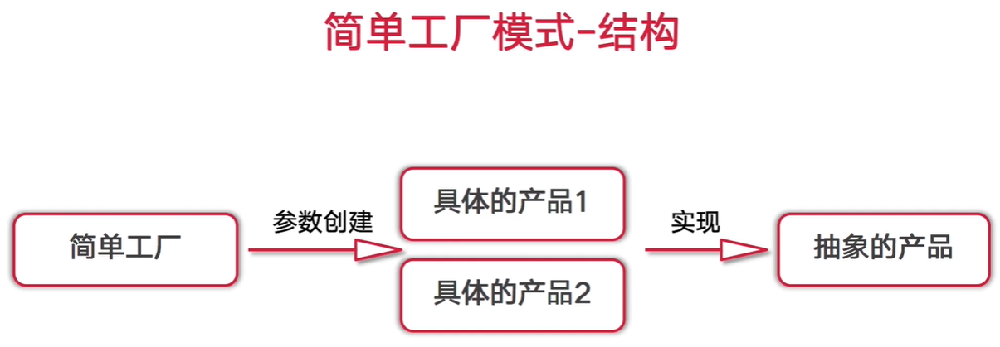
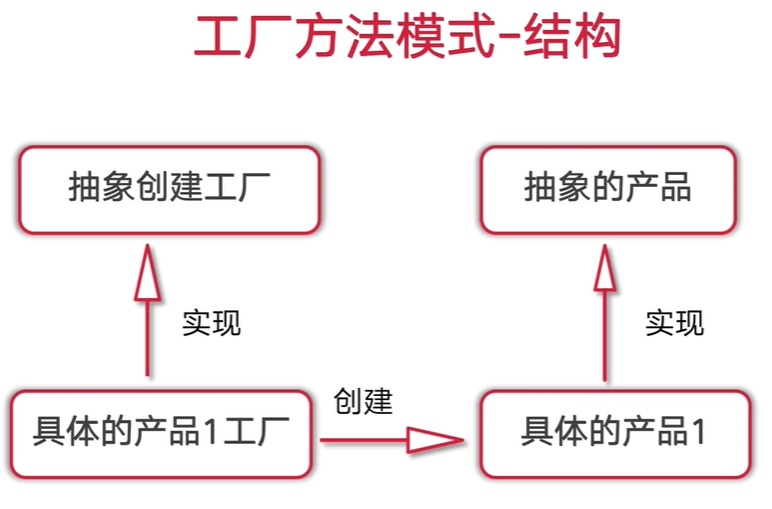

# 设计模式

##  简单工厂模式



 ### 思路

1.创建抽象类(结构)

2.创建具体的类, 并实现抽象类的方法

3.创建工厂类,实现工厂方法


### 实现

```go
package mode

import "fmt"

//抽象产品
type Product interface {
   GetName() string
   SetName(string)
}

//具体产品
type Product1 struct {
   name string
}

func (p1 *Product1) GetName() string {
   return "product1.name=" + p1.name
}

func (p1 *Product1) SetName(s string)  {
   p1.name = s
}

type Product2 struct {
   name string
}

func (p2 *Product2) GetName() string {
   return "product2.name=" + p2.name
}

func (p2 *Product2) SetName(s string)  {
   p2.name = s
}


//工厂
type ProductFactory struct {
   p Product
}

//工厂参数
const (
   P1 = iota
   P2
)

//工厂实现
func (p *ProductFactory) Create(x int) Product  {
   if x == P1{
      return &Product1{}
   }
   if x == P2{
      return &Product2{}
   }
   return nil
}


//test
func test()  {
   pf := ProductFactory{}
   obj1 := pf.Create(P1)
   obj1.SetName("book")
   fmt.Printf("obj1 type %T ,%v",obj1,obj1.GetName())
}

```


### 遇到的问题


只有指针类型的Product2实现了Product接口.Product2没有实现,所以报错,改成 ```return &Product2{}``` 即可


## 工厂模式改加



