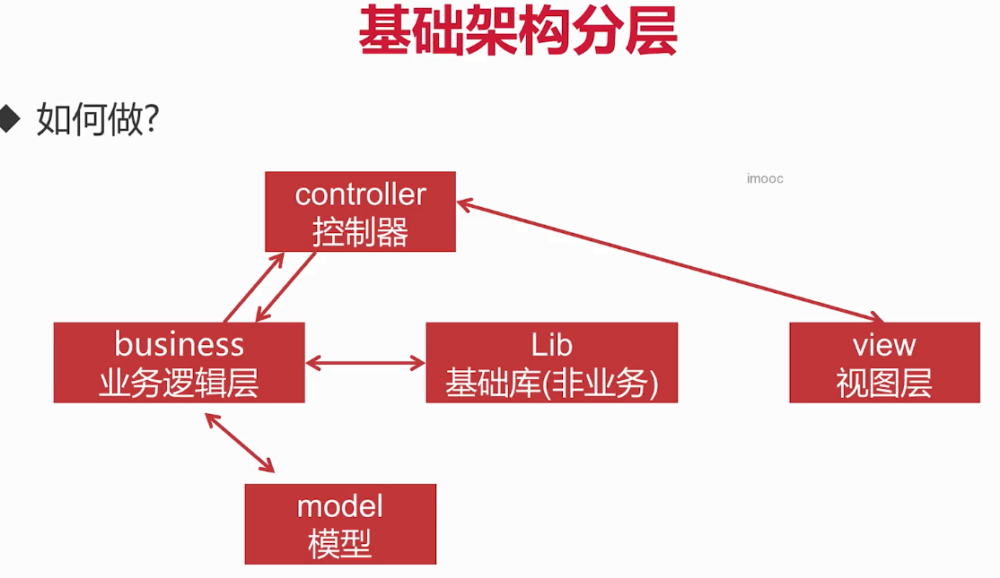

# PHP语法

一些简单的内容都省略了，主要是梳理知识点、查缺补漏

## 数据类型

三大数据类型：标量、复合、特殊

### 字符串

字符串定义方式：单引号、双引号、heredoc、newdoc

单引号：不能解析变量和转义字符，只能解析单引号和和反斜线，效率比双引号高

双引号：可以解析变量和转义字符

**heredoc**：类似双引号，用来处理大文本

```php
$b = <<<XXX
hi $a
     很多字符。。。。。
            20200901
XXX;
```

newdoc：类似单引号，用来处理大文本

```php
$c = <<<'XXX'
hi $a
     很多。。。。。。
            20200901
XXX;
```

### bool

false的七种情况： 0,	0.0,	'',	'0',	[],	null,	false

注意 

```php
var_dump(' ' == false);     //bool(false)
var_dump('00' == false);    //bool(false)
var_dump([0] == false);     //bool(false)
```


## 引用

引用意味着用不同的名字访问同一个变量内容

`$a =& $b;`

$a 和 $b 在这里是完全相同的，这并不是 $a 指向了 $b ，而是 $a 和 $b 指向了同一个地方。

### COW

copy on write   只有变量进行修改操作时才进行复制

```php
$a = range(0,1000);  		//定义$a，为$a开辟一块空间
var_dump(memory_get_usage());  //查看内存使用情况 int(431056)

$b = $a;  //定义$b,将a的值赋值给b，此时a、b指向同一块空间
var_dump(memory_get_usage());  //此时变化不大 int(431088)

//对a进行修改,此时开辟了一块新的空间，a、b指向不同
$a[0]=11;
var_dump(memory_get_usage());  // int(468008)
```

```php
$a = range(0,2);
xdebug_debug_zval('a');  //可以查看zval结构，需要先安装xdebug
//返回  a:(refcount=1,is_ref=0)=array(0=>(refcount=1,is_ref=0)=0...)
$b = $a
xdebug_debug_zval('a');  
//返回  a:(refcount=2,is_ref=0)=array(0=>(refcount=1,is_ref=0)=0...)
$a[0]=3;
xdebug_debug_zval('a');  
//返回  a:(refcount=1,is_ref=0)=array(0=>(refcount=1,is_ref=0)=0...)


//引用
$c = range(0,2);
xdebug_debug_zval('c');  
//返回  c:(refcount=1,is_ref=0)=array(0=>(refcount=1,is_ref=0)=0...)
$d = &$c
xdebug_debug_zval('c');  
//返回  c:(refcount=2,is_ref=1)=array(0=>(refcount=1,is_ref=0)=0...)
$c[0]=3;
xdebug_debug_zval('c');  
//返回  a:(refcount=2,is_ref=1)=array(0=>(refcount=1,is_ref=0)=0...)

//unset只会取消引用，不会销毁空间
unset($b);
var_dump($a);
```


refcount：指向这块空间的变量个数

is_ref：是否是引用


**对象本身就是引用传递**,可以使用clone()进行对象复制

```php
class Person {
    public $name = 'lili';
}

$a = new Person();
xdebug_debug_zval('a');   // a:(refcount=1,is_ref=0)

$b = $a;
xdebug_debug_zval('a');   // a:(refcount=2,is_ref=0)

$b->name = 'alex';
xdebug_debug_zval('a');   // a:(refcount=2,is_ref=0)
var_dump($a->name);      // 'alex'
```


例题

```php
$data = ['a','b','c'];
foreach ($data as $k=>$v){
    $v = &$data[$k];
}
var_dump($data);   //['b','c','c']

```

每次循环中，当前单元的值被赋给 *$v*，当前单元的被赋给变量 *$k*并且数组内部的指针向前移一步（因此下一次循环中将会得到下一个单元）。

k=0 			   v=a									v=&$data[0],即v指向data[0]的空间

k=1 			   v=b 即 data[0]=b 			v=&$data[1]	

k=2 			   v=c 即 data[1]=c 			v=&$data[2]


### 引用返回

在方法声明和使用方法的时候都要使用 &


## 常量

常量只能包含标量数据

常量定义：const、define。const更快、是语言结构，define是函数

```php
const PI = 3.14;
define("FOO",     "something");
```


## 内置变量与常量

### 超全局变量

超全局变量是在全部作用域中始终可用的内置变量

回想一下有哪些超全局变量，它们包含什么内容

- $GLOBALS	包含了全局作用域中的全部变量

- $_REQUEST  HTTP Request 变量，默认包含 $ _GET  $ _POST $ _COOKIE

- $_GET            通过 URL 参数传递给当前脚本的变量的数组

- $_POST         当 HTTP POST 请求的 Content-Type 是 *application/x-www-form-urlencoded* 或 *multipart/form-data* 时，会将变量以关                    联数组形式传入当前脚本。

- $_FILE            通过 HTTP POST 方式上传到当前脚本的项目的数组，如文件上传

- $_SESSION

- $_COOKIE

- $_ENV

- $_SERVER	服务器和执行环境信息

  SERVER_ADDR	当前运行脚本所在的服务器的 IP 地址。

  SERVER_NAME	当前运行脚本所在的服务器的主机名。

  REQUEST_TIME	请求开始时间戳

  QUERY_STRING	查询字符串

  HTTP_REFERER	引导用户代理到当前页的前一页的地址（如果存在）

  HTTP_USER_AGENT	当前请求头中 *User-Agent:* 项的内容

  REMOTE_ADDR	浏览当前页面的用户的 IP 地址

  REMOTE_HOST	浏览当前页面的用户的主机名

  REQUEST_URI	指定要访问的页面


### 超全局常量

__ FILE__          

__ LINE__

__ DIR__

__ CLASS__

__ METHOD__

__ FUNCTION__

__ TRAIT

__ NAMESPACE__


## 运算符

错误控制运算符@，将@后面表达式产生的任何错误信息都忽略掉

**优先级**

递增递减  >  算术运算符  >  比较运算符  >  &&  >  ||  >   三目   >  赋值   >    and  > or  

```php
$a = 0;
$b = 0;
if($a = 3 > 0 || $b = 3 > 0){
    var_dump($a,$b);   //bool(true)  int(0)
    $a++;
    $b++;
    var_dump($a,$b);   //bool(true)  int(1)
}
//执行顺序：先执行左边的 3>0 为 true  ，||短路作用 （$b = 3 > 0）不执行，最后执行 $a = true
//true++ 还是 true
```


## 流程控制

### 遍历数组的几种方式

for ：只能遍历索引数组

foreach：可以遍历索引数组和关联数组，会reset() (让数组指针指向开头)

while、list() : 可以遍历索引数组和关联数组，但不会reset() ，需要手动reset，否则遍历数据可能不全

each() :  PHP 7.2.0开始废弃，不建议使用


### switch...case...

switch后面的控制表达式类型只能是整型、浮点型、字符串

switch中continue等同于break

switch  case会生成**跳转表**，直接跳转到对应case，不用一层层判断

效率：如果条件比较复杂或者在很多次的循环中，用switch可能会更快一些


**例题：PHP中如何优化多个if...elseif...语句的情况**

解：1、将可能性较大的条件尽量往前挪、

​        2、如果条件比较复杂、且判断的值是整型、浮点型、字符串可以使用switch case


## 函数


## static关键字

- 局部函数域生成静态变量

  ```php
  //变量 $a 仅在第一次调用 test() 函数时被初始化，之后每次调用 test() 函数都会输出 $a 的值并加一
  function test()
  {
      static $a = 0;
      echo $a;
      $a++;
  }
  ```

  

- 12

## include和require

被包含文件先按参数给出的路径寻找，如果没有给出目录（只有文件名）时则按照 include_path 指定的目录寻找。如果在 include_path 下没找到该文件则 include 最后才在调用脚本文件所在的目录和当前工作目录下寻找。如果最后仍未找到文件则 include 结构会发出一条警告（**`E_WARNING`**），脚本继续执行；这一点和 require 不同，后者会发出一个致命错误（**`E_COMPILE_ERROR`** ），导致脚本终止。

include_once / require_once 和 include / require 唯一区别是 PHP 会检查该文件是否已经被包含过，如果是则不会再次包含。


# PHP安全之道

## 安全原则

不可信原则：用户不可信，对所有用户的输入输出进行检查，保证传输安全（数据添加时效性、数据加密）

最小化原则：将用户的可见范围控制在允许的最小范围，权限最小化、暴露最小化

简单就是美：易读易维护、系统安全有保障、性能扩展性强

组件的安全：明确来源、关注官方信息


## PHP配置安全

### 信息屏蔽

display_errors = off     ;关闭错误提示

expose_php = off         ;http请求中关闭PHP版本信息

### 访问限制

文件系统限制

open_basedir = /home/web/       ;限定PHP的访问目录为 /home/web/


远程访问限制

alllow_url_fopen = off         ;禁用PHP远程URL访问

allow_url_include = off        ;禁用远程include文件包含


### 开启安全模式

safe_mode = on         ;开启安全模式（强烈建议）

safe_mode_gid = off  ;


### 禁用危险函数

disable_functions = phpinfo,eval,chgrp,chown,scandir 


## 编码安全

### 弱数据类型安全

```php
		var_dump(0 == 'xxx');          //bool(true)
        var_dump(0 == false);          //bool(true)
        var_dump('0' == false);        //bool(true)
        var_dump('0e123456' == 0);     //bool(true)
        var_dump('0e123456a' == 0);    //bool(true)
        var_dump('0e1234567' == '0');  //bool(true)
        var_dump('0e1234abcd' == '0'); //bool(false)

		//bool比较缺陷
		var_dump(true == 'root');   //bool(true)
```

判断完全相等时使用 ===

#### hash比较缺陷

```php
		//hash比较缺陷
        var_dump(md5('s878926199a'));    //0e545993274517709034328855841020
        var_dump('0e342768416822451524974117254469'==md5('s878926199a'));  //bool(true)
        var_dump('0e54599'== '0e1244');  //bool(true)
```

hash比较时，如果hash值以`0e`开头，后面都是数字，当与数字进行比较时就会被解析成 0* 10^n，被判断成与0相等，

应该使用`hash_equals()`函数进行严格字符串比较，或使用===


#### 

### 函数安全

in_array()、array_search()，$strict参数没有设置为true，函数将使用松散比较

```php
$arr = [0,1,2];
var_dump(in_array('ab',$arr));          //bool(true)
var_dump(array_search('2a',$arr));      //int(2)
```


## 常见漏洞与防护

### sql注入

通过伪造客户端请求，把sql命令提交到服务器进行非法请求的操作

，主要原因在于数据和代码指令是混合的

#### 普通注入

select  * from t  where id = 1 or 1=1;      

查询出所有数据

#### 隐式类型注入

select * from t   where email =0；

数据表中的email字段是字符型，传入了int型，数据类型不一致，mysql查询优化器会将数据类型进行隐式转换，email值转换成0

查询出所有数据

#### 宽字节注入

前提：数据库和程序编码都是GBK

在使用addslashes()对参数进行转义后，某些汉字和反斜杠组合变成新的汉字，导致转义失效

#### 防护措施

- 使用mysql的**预编译**处理

  预编译分为编译、执行、释放三步，预编译遵循指令和数据分离的原则，可以有效防止sql注入（从根本上杜绝），并提高执行效率

- 校验和过滤

  对输入数据进行校验，判断数据类型是否合法、是否包含sql关键字、进行addslashes()转义

- 针对宽字节注入防护

  将character_set_client设置为binary，所有数据以二进制的形式传递，可以有效避免宽字节注入

- 禁用魔术引导

  magic_quotes_gpc=off

 

### XSS


### CSRF

跨站请求伪造（cross-site request forgery），是一种使已登录用户在不知情的情况下执行某种动作的攻击


攻击者借助受害者的cookie骗取服务器的信任。攻击者无法拿到cookie，由于同源策略的限制也无法解析服务器返回的结果。

所以对改变数据的服务需要进行CSRF防护，而对于请求数据的服务则不需要

#### 防御方法

**使用Referer校验请求**

在服务器端检查HTTP header中的Referer字段，判断Referer是否是自己的站点，如果不是则拒绝访问

简单方便，但是安全性依赖第三方

**添加校验token**

在表单请求中添加token认证机制，必须保证token唯一

**在HTTP头中自定义属性并验证**

也是使用token进行验证，但是把token放在HTTP头中自定义属性里

局限性非常大：通过XMLHttpRequest类实现，而XMLHttpRequest请求一般用于ajax

**重要页面表单添加验证码**

输入图片验证码或短信验证码


### SSRF


### 跨域问题


### 反序列化


## cookie安全

session.cookie_httponly = 1   ;开启httponly

httponly让cookie在浏览器中不可见，防止脚本通过document对象获取cookie

session.cookie_secure  = 1     ;开启secure，cookie只能通过HTTPS传输


 


# tp6开发高并发电商服务系统


## tp5与tp6的区别

tp5的框架源码放在thinkphp目录中，而tp6框架源码放在vendor目录中

tp5可以直接下载源码，tp6只能通过composer安装

类自动加载机制：tp5 composer+自己的机制， tp6 composer

严格模式：tp5没有，tp6有	


## 前期准备

创建多应用（模块）模式

composer require topthink/think-multi-app

目录结构

app

​		--admin

​		--api


安装think-view、think-captcha组件

composer require topthink/think-view

composer require topthink/think-captcha


### config

```php
return [
    'access_key_id' => 'LTAI4GAf6oshdZPQZwRuGLXw',
    'access_secret' => 'GbFYB02nFvkgjzL5g6WBFwFnlqrRo3',
    'region_id' => 'cn-hangzhou',
    'host' => 'dysmsapi.aliyuncs.com',
    'sign_name' => '求知',
    'template_code' => "SMS_190070657",
];

'redis' => [
            'type'   => 'redis',
            'host'       => '111.229.91.208',
            'port'       => 6379,
            'password'   => 'redis',
        ]
```


# 架构

## 负载均衡

[将请求负载到多个服务中，从而达到高并发高可用的状态](https://coding.imooc.com/learn/questiondetail/191595.html)

nginx负载均衡模式

- 轮训模式

- weight权重模式

- ip_hash

  

ngnix负载均衡配置主要是对proxy_pass 和 upstream的配置，需要在http模块下配置upstream模块，然后在server模块下配置proxy_pass模块

```
upstream mall_proxy {
	server 127.0.0.1:8081; //模拟两台不同的服务
	server 127.0.0.1:8082;
}


location / {
 	proxy_pass http://mall_proxy;
 	proxy_set_header Host $host:$server_port;
}
```


注意事项：此时一些文件和session之类的数据不能存放在本地，而要用专门的文件服务器进行存储


## 前端页面静态化处理

[提升服务整体qps](https://coding.imooc.com/learn/questiondetail/191597.html)

​	

## 数据库集群


### 读写分离


**怎样保证PHP不同请求落主或者落从，让cud操作走主库，r操作走从库？**

方法一：直接在PHP业务层实现，cud操作直接转发到主数据库。操作比较繁琐，如果数据库地址变化，需要很多修改

方法二：使用db_proxy（比如开源的mycat），主要流出是PHP请求db_proxy,db_proxy判断请求哪个库，PHP层不需要关注降低维护成品


**怎样保证主从一致性** 一般在1s内可以同步完

1、在db_proxy设置，设置cud操作200ms内，r操作走主库

2、db_proxy检测机制，如果同步操作未完成，db_proxy会把请求转发到主库 

3、cud操作完成后，数据存到redis，读数据的时候先读redis，redis没有再读从库


### [分库分表](https://tech.meituan.com/2016/11/18/dianping-order-db-sharding.html)

解决单表数据量大查询慢的问题

# 经验之谈

## 分层

常规是MVC分层，我们可以细分为五层架构

Controller ： 数据校验，调用Business，返回数据给view

Business： 业务逻辑层，处理真正的业务逻辑，调用Model和Lib

Model：操作数据库

Lib：基础类库（非业务），比如array操作，str操作，对接sms

View：视图层




## 异常捕获

一般有两个捕获场景，business层和controller层

business层捕获model层的异常，异常信息可能包含数据库信息，不能暴露给用户，此时需要记录日志

controller层捕获business层手动抛出的异常，比如用户未登录，此时异常信息[status,msg]是是需要展示给前端的


