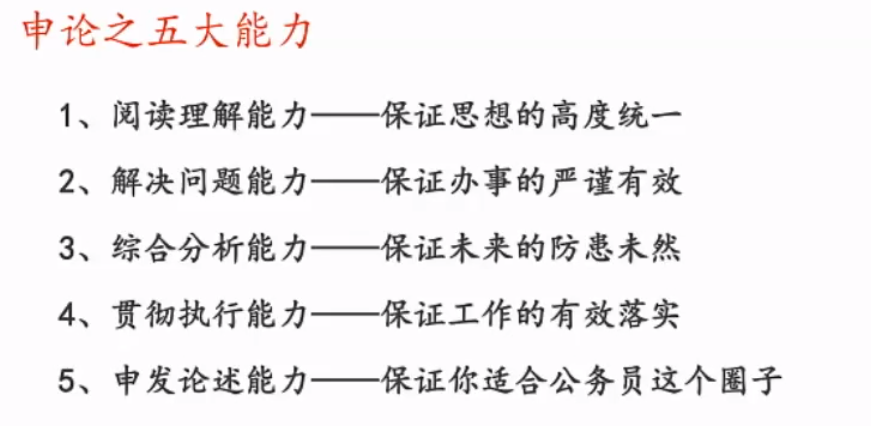

## 阅读理解概括题

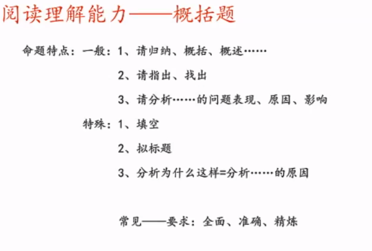

强调准确全面

不需要进行加工 

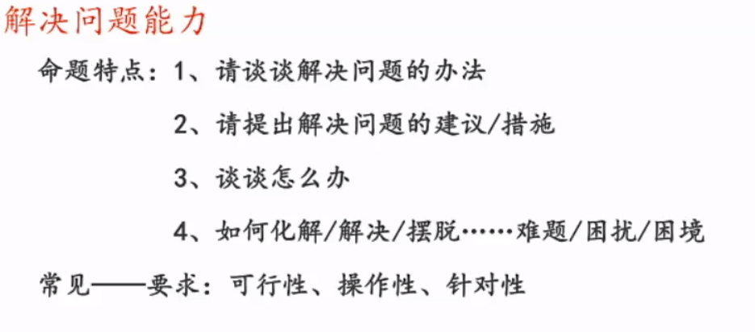

贯彻题

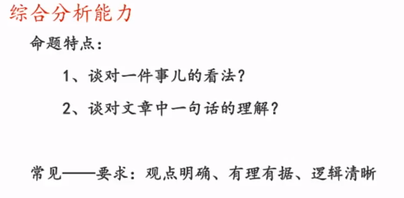

## 审题

### 核心三步

#### 1看题干确定题型

谈对一个词的理解,如果要求是准确、全面，就是概括题；如果要求是观点明确、有理有据、论证充分，就是分析题

谈对一个事看法或一句话的理解就是分析题

分析xx原因或影响，是概括题

根据资料四,谈谈你对"想象力经济"的理解

要求:准确,全面;不超过200字

归纳概括题

#### 2确定资料范围

根据给定资料1：只看给定资料1

除了根据给定资料n，都是题干出现给定资料x，就重点看资料x，其它的资料当中可能有1-2个点。比如结合给定资料2（给定资料2中xx的含义）这种题目，就应该重点看资料2，然后扫一下资料1和3或者其它同主题的资料

### 3确定问数

注意题干中 “并、以及、这” 之类的字眼

注意题干中的要求

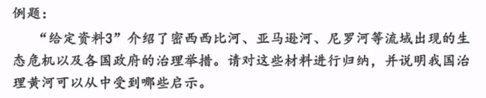

这道题有三问：1归纳三条河流出现的生态危机；2归纳各国政府的治理举措；3说明我国治理黄河可以收到的启示

分三段写

4字数

控制在给定范围之内，要求800~1000，作答不能超出范围；要求1000左右，作答范围为900~1100，超过或低于50字扣1分

## 评分标准 答题结构

### 分析题

总分总

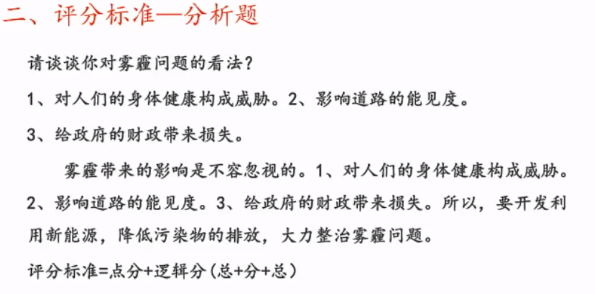

### 贯彻题

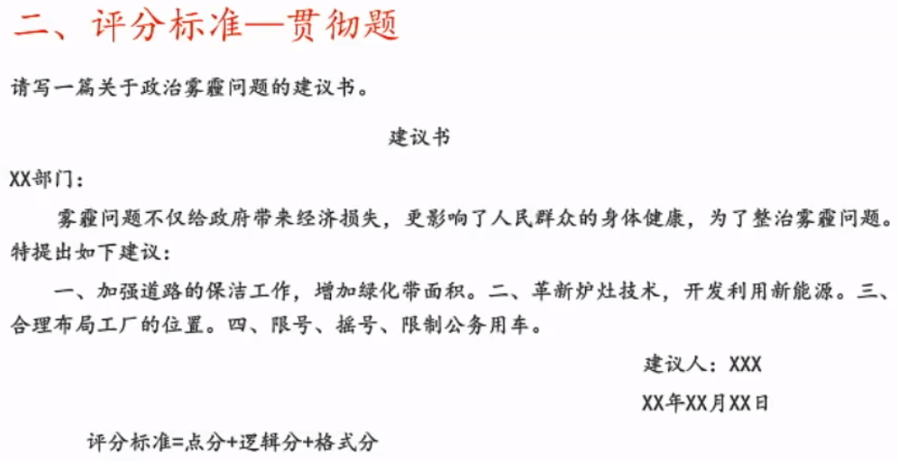

### 概括题

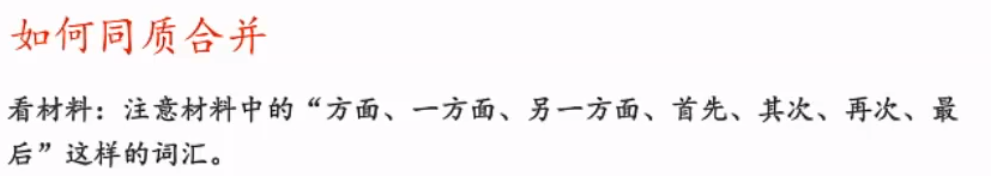

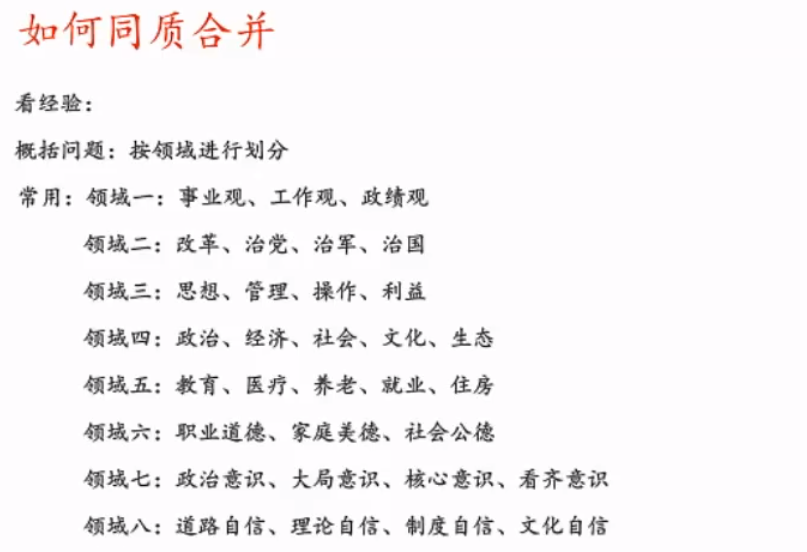

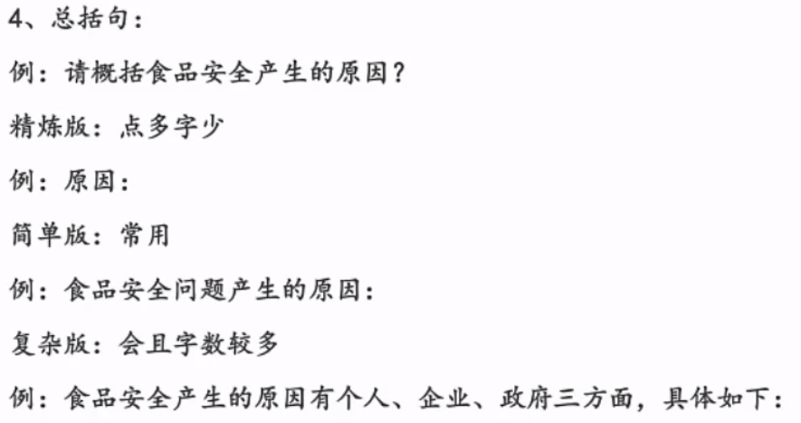

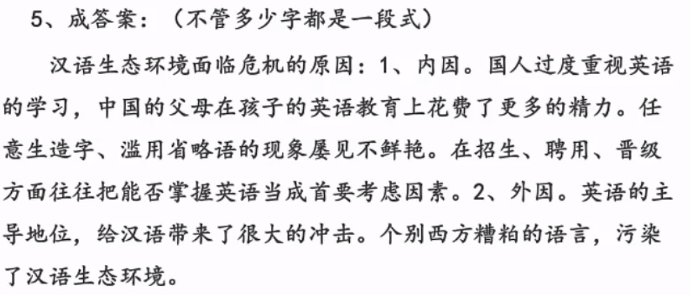

