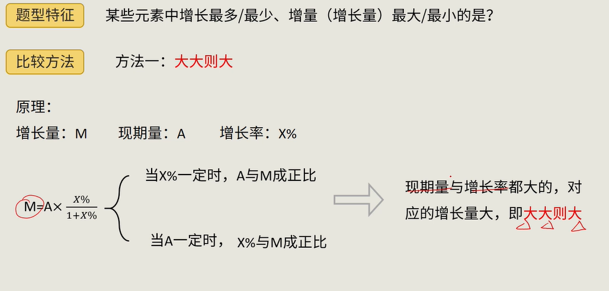
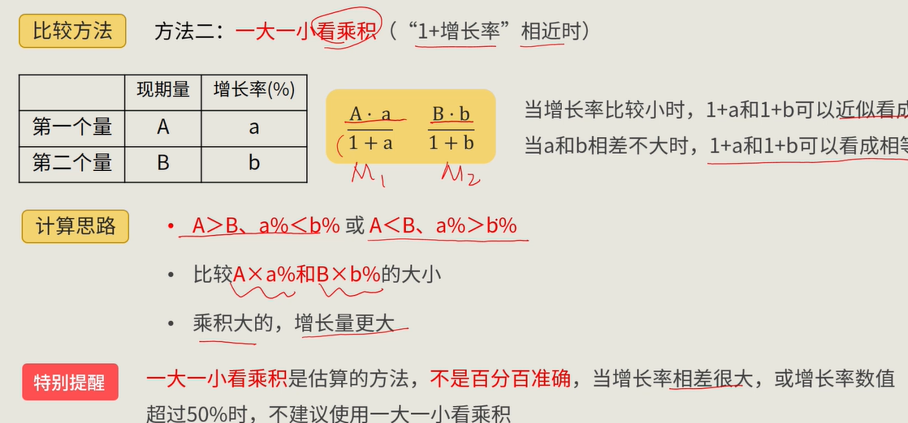
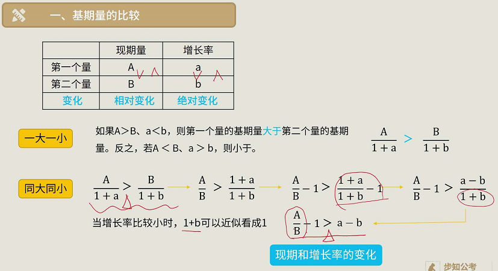
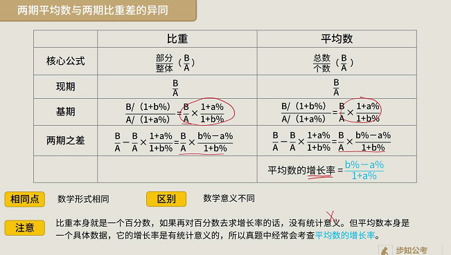
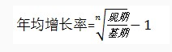

# 资料分析

## 分数大小比较

1.分数特性: 分子分母一大一小  ,分子越大且分母越小,值越大


2.相对变化: 分子分母一个相差很大,一个相差很小


3.化同法: 分子分母同大同小,且分子分母相差都很大

比较分子大、分母大和分子小、分母小的分数时，放大或缩小某个分数，使两者的分子或分母尽可能相近。

放大缩小后，若出现一个“分子大而分母小”的分数，直接判大小。

若两个分数的分子相近，分母相差较大，则分母小的分数较大；若分母相近，分子相差大，则分子大的分数大。


4.差分法: 分子分母同大同小,且分子分母相差都很小

求差分数，“差分数”大于/小于“小分数”，则“大分数”大于/小于“小分数”。


5.反面法:正面不好比较可以比较(1-分数)的大小


6.直除法: 不一定要除完,能根据首几位数确定答案即可


## 增长量相关

增长量 M       现期 A         增长率  X%

### 求增长量

增长量=现期量-基期量=现期量×x%/（1+x%）

当x%=1/n时，增长量=A/（n+1）
当x%=-1/n时，增长量=-A/（n-1）

```
m = a*1/n  /  (1+1/n)

m = a /n  / ((1+n)/n)

m = a /(n+1)
```


### 增长量估算

**缩小取大，放大取小。** 把增长率缩小,所求出的增长量当然小于实际值,所以要取稍微大一点的值

建议

记住几个特殊分数值: 1/3  1/4  1/5  1/6   1/7  1/8  1/9

适用于选项相差较大的情况


### 增长量大小比较

比较方法一: **大大则大**  ,现期量与增长率都大的,对应的增长量大

M = A * ( X% / (1+X%))




比较方法二: 一大一小看乘积    ,比较A * a   B * b

两种使用条件:

增长率很小时,1+a 和  1+b 可以近似看成 1

增长率相差不大时,1+a 和 1+b 可以看成相等




##  增长率

 现期 A  基期B   增长率x%

增长率   x% = (A-B) / B


### 增长率大小比较

x1% = (A1-B1) / B1  = A1/B1 - 1

x2% = (A2-B2) / B2  = A2/B2 - 1

直接比较   **现期 /基期** 即可


## 基期

基期量 = A / (1+x%)

### 大小比较

**1+x%未出现成倍变化时，着重比较现期量；1+x%出现成倍变化时，需估算进行判定。**


**一大一小**  现期量大且增长率小,基期量更大

**同大同小** 





### 计算

**Ix%I＞5%时，直除**


**Ix%I＜5%时，化除为乘。**

基期量 = A / (1+x%)  = A(1-x%)  / (1+x%)(1-x%)

​			= A(1-x%)  / (1 - x%*x%)

Ix%I＜5%   , (1 - x%*x%) 近似看成 1 ,基期量约等于 A(1-x%) 

**注意**

适用范围Ix%I＜5%, Ix%I越小,估算值越接近实际值

误差约为 A * x% * x%

估算的结果比实际数据略小


## 间隔增长

### 间隔增长率

题目特征：间隔一个统计周期求值。如已知2018年的值，求2018年相较于2016年的增长率。

现期  A    基期 B     第一次增长率  r1%      第二次增长率  r2%    间隔增长率r%

r% = B(1+r1%)(1+r2%) / B

**间隔增长率r%=r1%+r2%+r1%\*r2%。**

当r1%  r2%很小时   r%近似 r1%+r2%


### 间隔基期/现期量

原理一样  B=A / (1+r%)       A = B (1+r%) 


### 间隔倍数

倍数 = 现期 / 基期

​         = r% + 1


### 间隔增长量

间隔增长量 =  B * r% =  A / (1+r%) * r%


## 比重

比重：某事物在整体中所占的分量。资料分析中，一般指部分在总体中所占的百分比。

比重=部分/整体。那么，整体=部分/比重

A是B的C倍，那么A比B多C-1倍


**已知“整体是A，比上期增长a%；部分是B，比上期增长b%”类考题，一般会考比重有关的小题。**

现期：部分占整体的比重：B/A

基期：整体= A/(1+a%) ； 部分= B/(1+b%)

基期比重：(B/（1+b%）)/(A/（1+a%）)=[B/A]×[(1+a%)/(1+b%）]

**基期比重速算技巧** 当a%与b%非常接近时,估算B/A即可


**两期的比重之差**： B/A-B/A×(1+a%)/(1+b%)=B/A×(b%-a%)/(1+b%)

由“差=B/A×(b%-a%)/(1+b%)”可知，只需比较a%和b%的高低，即可判定两期比重高低。

**口诀：部分增长率大于整体时，其所占比重上升。【即大于基期的比重】**


当要计算比重差值时,先计算(b%-a%)判断正负,


## 平均数

现期总量 B   增长率 b%     现期个数 A     增长率 a%

平均数=总数/个数=B/A。格式等同于比重：比重=部分/整体。

两个平均数的差： B/A-B/A×(1+a%)/(1+b%)=B/A×(b%-a%)/(1+b%)。

**平均数的增长率（现平均数比原平均数增长了x%）：x%= (b%-a%)/(1+a%)。**

**资料分析中一般不会考两个平均数的大小比较，偏向于求x%的具体的值，解题时可适当估算。**





## 年均增长量/增长率

年均增长量=总增长量/年数=(现期-基期)/年份差

现期=基期×（1+年均增长率）^年数




现期  A    基期 B     第一次增长率  r1      第二次增长率  r2    年均增长率r

B* (1+r)^n  = B* (1+r1) *  (1+r1) * ...*  (1+rn)

当r小于10%时，可用（1+r）^n≈1+n×r 进行估算


## 混合模型

A部分增长a%；B部分增长b% (a> b)；整体来看增长c%；可得：a%>c%>b%。

混合增长率介于部分增长率最大值与最小值之间  (多个部分同样适用)


**整体增长率介于平均值和基期量较大的增长率之间。**

混合增长率偏向基期数更大的一边  (可以参考两杯不同浓度的溶液混合在一起) ,介于基期值更大的部分增速和部分增速的平均数之间

A>B   时          混合增长率介于    (a% +b%)/2  ,  a%  之间


