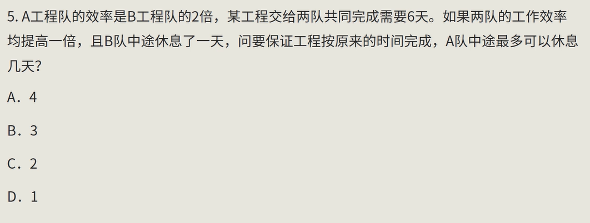
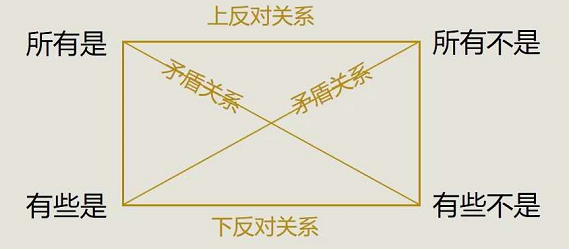
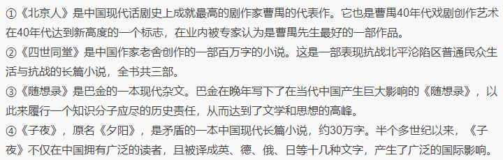
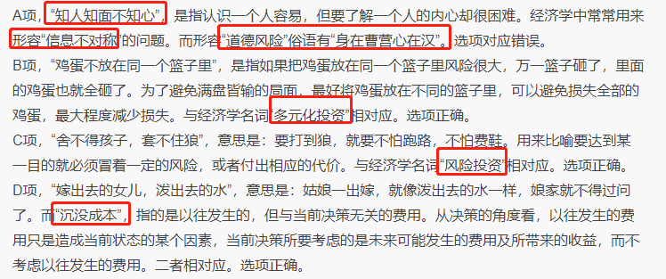

# 资料分析

## 分数大小比较

1.分数特性: 分子分母一大一小  ,分子越大且分母越小,值越大


2.相对变化: 分子分母一个相差很大,一个相差很小


3.化同法: 分子分母同大同小,且分子分母相差都很大

比较分子大、分母大和分子小、分母小的分数时，放大或缩小某个分数，使两者的分子或分母尽可能相近。

放大缩小后，若出现一个“分子大而分母小”的分数，直接判大小。

若两个分数的分子相近，分母相差较大，则分母小的分数较大；若分母相近，分子相差大，则分子大的分数大。


4.差分法: 分子分母同大同小,且分子分母相差都很小

求差分数，“差分数”大于/小于“小分数”，则“大分数”大于/小于“小分数”。


5.反面法:正面不好比较可以比较(1-分数)的大小


6.直除法: 不一定要除完,能根据首几位数确定答案即可


## 增长量相关

增长量 M       现期 A         增长率  X%

### 求增长量

增长量=现期量-基期量=现期量×x%/（1+x%）

当x%=1/n时，增长量=A/（n+1）
当x%=-1/n时，增长量=-A/（n-1）

```
m = a*1/n  /  (1+1/n)

m = a /n  / ((1+n)/n)

m = a /(n+1)
```


### 增长量估算

**缩小取大，放大取小。** 把增长率缩小,所求出的增长量当然小于实际值,所以要取稍微大一点的值

建议

记住几个特殊分数值: 1/3  1/4  1/5  1/6   1/7  1/8  1/9

适用于选项相差较大的情况


### 增长量大小比较

比较方法一: **大大则大**  ,现期量与增长率都大的,对应的增长量大

M = A * ( X% / (1+X%))


比较方法二: 一大一小看乘积    ,比较A * a   B * b

两种使用条件:

增长率很小时,1+a 和  1+b 可以近似看成 1

增长率相差不大时,1+a 和 1+b 可以看成相等


##  增长率

 现期 A  基期B   增长率x%

增长率   x% = (A-B) / B


### 增长率大小比较

x1% = (A1-B1) / B1  = A1/B1 - 1

x2% = (A2-B2) / B2  = A2/B2 - 1

直接比较   **现期 /基期** 即可


## 基期

基期量 = A / (1+x%)

### 大小比较

**1+x%未出现成倍变化时，着重比较现期量；1+x%出现成倍变化时，需估算进行判定。**


**一大一小**  现期量大且增长率小,基期量更大

**同大同小** 


### 计算

**Ix%I＞5%时，直除**


**Ix%I＜5%时，化除为乘。**

基期量 = A / (1+x%)  = A(1-x%)  / (1+x%)(1-x%)

​			= A(1-x%)  / (1 - x%*x%)

Ix%I＜5%   , (1 - x%*x%) 近似看成 1 ,基期量约等于 A(1-x%) 

**注意**

适用范围Ix%I＜5%, Ix%I越小,估算值越接近实际值

误差约为 A * x% * x%

估算的结果比实际数据略小


## 间隔增长

### 间隔增长率

题目特征：间隔一个统计周期求值。如已知2018年的值，求2018年相较于2016年的增长率。

现期  A    基期 B     第一次增长率  r1%      第二次增长率  r2%    间隔增长率r%

r% = B(1+r1%)(1+r2%) / B

**间隔增长率r%=r1%+r2%+r1%\*r2%。**

当r1%  r2%很小时   r%近似 r1%+r2%


### 间隔基期/现期量

原理一样  B=A / (1+r%)       A = B (1+r%) 


### 间隔倍数

倍数 = 现期 / 基期

​         = r% + 1


### 间隔增长量

间隔增长量 =  B * r% =  A / (1+r%) * r%


## 比重

比重：某事物在整体中所占的分量。资料分析中，一般指部分在总体中所占的百分比。

比重=部分/整体。那么，整体=部分/比重

A是B的C倍，那么A比B多C-1倍


**已知“整体是A，比上期增长a%；部分是B，比上期增长b%”类考题，一般会考比重有关的小题。**

现期：部分占整体的比重：B/A

基期：整体= A/(1+a%) ； 部分= B/(1+b%)

基期比重：(B/（1+b%）)/(A/（1+a%）)=[B/A]×[(1+a%)/(1+b%）]

**基期比重速算技巧** 当a%与b%非常接近时,估算B/A即可


**两期的比重之差**： B/A-B/A×(1+a%)/(1+b%)=B/A×(b%-a%)/(1+b%)

由“差=B/A×(b%-a%)/(1+b%)”可知，只需比较a%和b%的高低，即可判定两期比重高低。

**口诀：部分增长率大于整体时，其所占比重上升。【即大于基期的比重】**


当要计算比重差值时,先计算(b%-a%)判断正负,


## 平均数

现期总量 B   增长率 b%     现期个数 A     增长率 a%

平均数=总数/个数=B/A。格式等同于比重：比重=部分/整体。

两个平均数的差： B/A-B/A×(1+a%)/(1+b%)=B/A×(b%-a%)/(1+b%)。

**平均数的增长率（现平均数比原平均数增长了x%）：x%= (b%-a%)/(1+a%)。**

**资料分析中一般不会考两个平均数的大小比较，偏向于求x%的具体的值，解题时可适当估算。**


## 年均增长量/增长率

年均增长量=总增长量/年数=(现期-基期)/年份差

现期=基期×（1+年均增长率）^年数


现期  A    基期 B     第一次增长率  r1      第二次增长率  r2    年均增长率r

B* (1+r)^n  = B* (1+r1) *  (1+r1) * ...*  (1+rn)

当r小于10%时，可用（1+r）^n≈1+n×r 进行估算


## 混合模型

A部分增长a%；B部分增长b% (a> b)；整体来看增长c%；可得：a%>c%>b%。

混合增长率介于部分增长率最大值与最小值之间  (多个部分同样适用)


**整体增长率介于平均值和基期量较大的增长率之间。**

混合增长率偏向基期数更大的一边  (可以参考两杯不同浓度的溶液混合在一起) ,介于基期值更大的部分增速和部分增速的平均数之间

A>B   时          混合增长率介于    (a% +b%)/2  ,  a%  之间


# 数学运算

## 数学特性

被 2 整除的数

被 3 整除的数

被 4 整除的数

被 5 整除的数

被 8 整除的数,课可以先判断能否被 2整除,只需要判断后三位即可(1000能被8整除,只用看后三位余数)

被 9 整除的数 ,各位数字之和能被9整除


**倍数特性**：如果a：b=m：n（m与n互质），则a是m的倍数，b是n的倍数，a±b是m±n的倍数。

技巧:根据倍数特性提取公约数,从而判断选项

```
29a + 24b = 900  //已知a b 是正整数
29a = 900 - 24b
29a = 12*(75-24b)
=> a是12的倍数
```


## 行程问题

`S = V*T`

等时间平均速度:以速度v1行驶t分钟,以速度v2行驶t分钟

```
s = v1*t + v2 * t
s = v * 2t
v = (v1 + v2) / 2
```


等距离平均速度:以速度v1行驶s米,以速度v2行驶s米

```
t1 = s / v1
t2 = s / v2
2s = v * (t1 + t2)
2 = v * (1/v1 + 1/v2)
v = 2*v1*v2 / (v1+v2)
```


### 相遇

**直线上第n次相遇时(到达直线端点师折返)，路程和=2n-1个全程**

**环线上第n次相遇时，路程和=n个全程**


### 追及

两种情形:同时不同点,同点不同时


**路程差=速度差\*追及时间**

**环形上追上n次，路程差=n个周长。**


## 工程问题

例题


解题思路:先判断一共需要工作几天,如果按最快的两个丙工作: 80 / (8+8) =5,如果按最慢的两个甲96 / (8+8)=6,   5<工作天数<6,所以甲工作了4天 




解题思路,效率提高一倍则共同完成需要3天,即AB都工作三天休息三天,现在B只休息了一天,所以A休息的天数大于3天


## 排列组合

**定序问题缩倍法：A(n,n)/A(m,m)。**

即n个元素中有m个元素是确定顺序的,一共有A(n,n)/A(m,m)种排法

例: a ,b ,c ,d , e 五个人并排站成一排,如果b必须站在a的右边(a,b不一定相邻),那么一个有多少种排法

解: 一共有A(5,5)  /  A(2,2) = 60种排法


**选排问题先取后排**

例:四个不同的小球放入编号为1,2,3,4的四个盒子当中,则恰有一个空盒的方法共有多少种

解:先取小球一共是C(4,2)种,再排列(放入盒子)一共是A(4,3)种,所以一共有144种


**“错位排序问题”牢记：D(4)=9，D(5)=44。**

D(1)=0，D(2)=1,  D(3)=2,  D(4)=9，D(5)=44   **D(n)=(n-1) * (D(n-1) + D(n-2))**

例:同室4人各写一张贺年卡,先集中起来,然后每人从中拿一张别人送来的贺年卡,则四张贺年卡的分配方式一共有多少种

解:一共有3*(2+1)=9种 


**圆桌排序：n个元素的坐法数=A(n-1,n-1)**

前提是所有椅子是一样的,环形排序和直线不一样,需要一个参照物

例,有8人参加一场婚宴,他们被安排在一张8个座位的圆桌就餐,问这8个人有多少种不同的坐法

解:一共有A(7,7)种


**涉及到对数字的排列组合，要考虑到0的特殊性，不能是最高位**


## 概率


# 逻辑判断

## 矛盾命题：

必为一真一假

## 直言命题：

判断事务是否具有某种性质的命题，包含六种：全称（特称|单称）肯定（否定）命题


**直言命题的矛盾关系（所有变有些，是变不是）**

原命题							矛盾命题

所有a都是b                 有些a不是b

有些a是b					 所有a都不是b

某个a是b 					某个a不是b


**直言命题的反对关系 **

上反对关系：至少有一假

下反对关系：至少有一真



**直言命题的推出关系 **

所有 推出 有些、所有推出某个、某个推出有些


## 条件命题

充分必要性：肯前肯后，否后否前

**除非否则，否一推一。**

除非你是胆小鬼，否则你一定能追到她

你不是胆小鬼  =》 你追到她

你没有追到她   =》 你是胆小鬼


## 联言命题 

a且b


## 相容选言命题

a或b

**摩根定律**

非（a且b）= 非a 或 非b

非（a或b）= 非a 且 非b


## 不相容选言命题

若干个判断有且仅有一个存在的命题

**代表词 要么······要么······· **

**a要么b为假，有两种情况：ab同时为真，ab同时为假**


## 朴素逻辑

### 破案题解题思路

例1：有两座岛，a岛的人都说真话，b岛的人都说假话，小张问岛屿上的一个人甲，你是a部落的吗，甲只能回答是；小张问你是b部落的吗，甲只能回答否


**同真同假的情况**

a说，b说的话是真的。此时，ab同真同假

a包含于b。此时，a真则b真，b假则a假

两两匹配，直接确定两个命题同真同假


## 易混淆的概念

生活中的“有些”：指一部分（1<部分<全部），“有些是”可以推出“有些不是”

逻辑中的“有些”：可以指1个，也可以指一部分，也可以指全部，不确定是哪种情况


**或者**：a或者b有三种情况：a真b假、a假b真、a真b真，即至少有一真


**原命题 a -> b  ,最不可能出现的情况是 a 且 非b**


北方人不都爱吃面食,但南方人都不爱吃面食如果已知上述第一个断定真，第二个断定假

推出：北方人有些不爱吃面食，南方人有些爱吃面食


## 注意

题干只有一真或只有一假，优先找直言命题（矛盾关系、反对关系）


# 常识判断


### 人文历史

诸子百家





### 生物

胰岛素是由胰脏内的胰岛β细胞受内源性或外源性物质如葡萄糖、乳糖、核糖、精氨酸、胰高血糖素等的刺激而分泌的一种蛋白质激素。胰岛素是机体内唯一降低血糖的激素，同时促进糖原、脂肪、蛋白质合成。外源性胰岛素主要用来糖尿病治疗。

胰高[血糖](https://baike.baidu.com/item/血糖)素（glucagon）亦称胰增血糖素或抗[胰岛素](https://baike.baidu.com/item/胰岛素/107964)或胰岛素B。它是伴随胰岛素由脊椎动物[胰脏](https://baike.baidu.com/item/胰脏/10306638)的胰岛[α细胞](https://baike.baidu.com/item/α细胞)分泌的一种激素。与胰岛素相对抗，起着增加血糖的作用。胰高血糖素对胰岛素的分泌起促进作用


### 经济

知人知面不知心，是指认识一个人容易，但要了解一个人的内心却很困难，经济学中常用来形容信息不对称的问题




