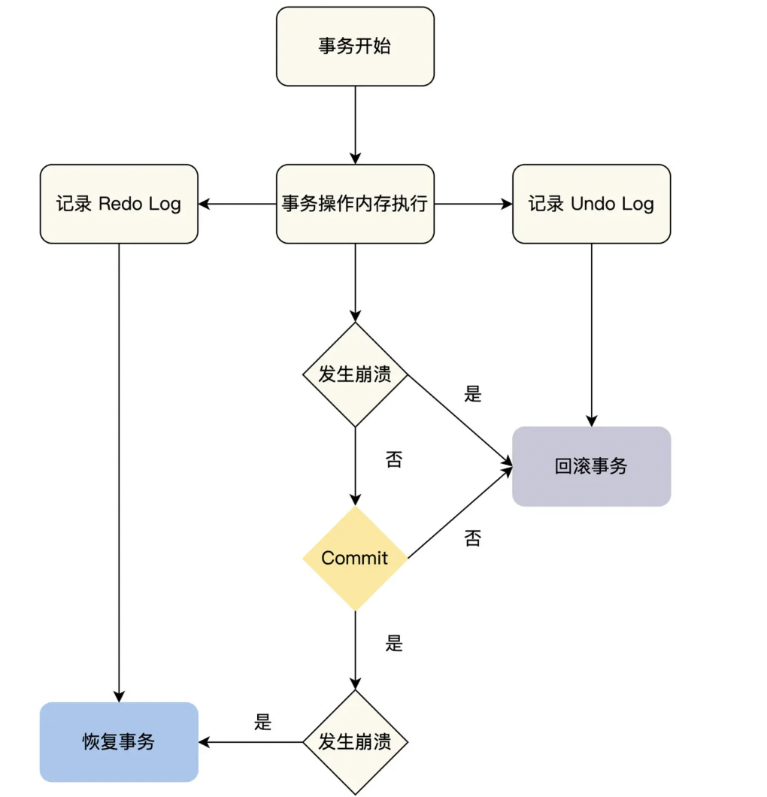
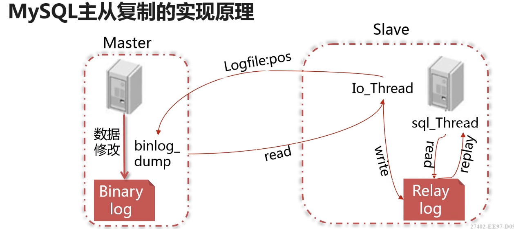
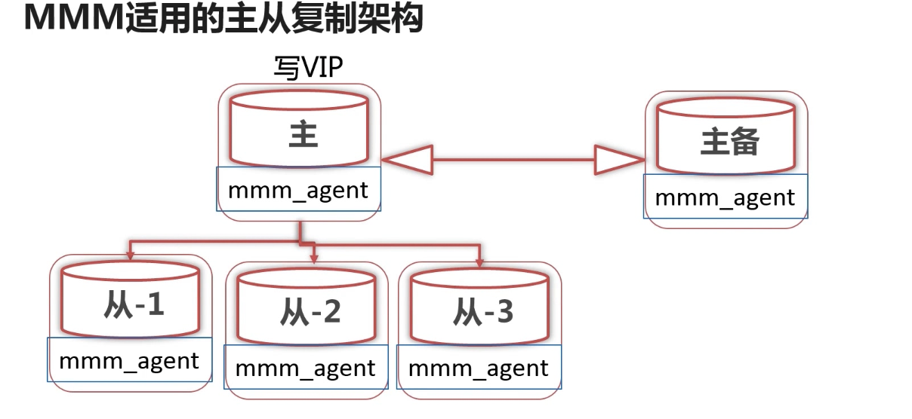
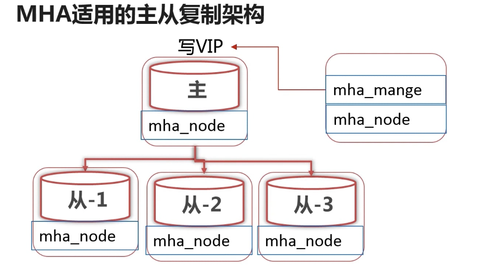
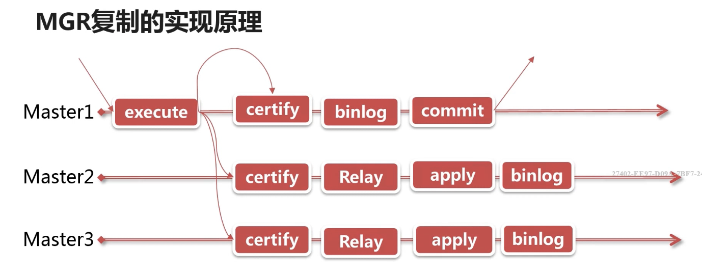
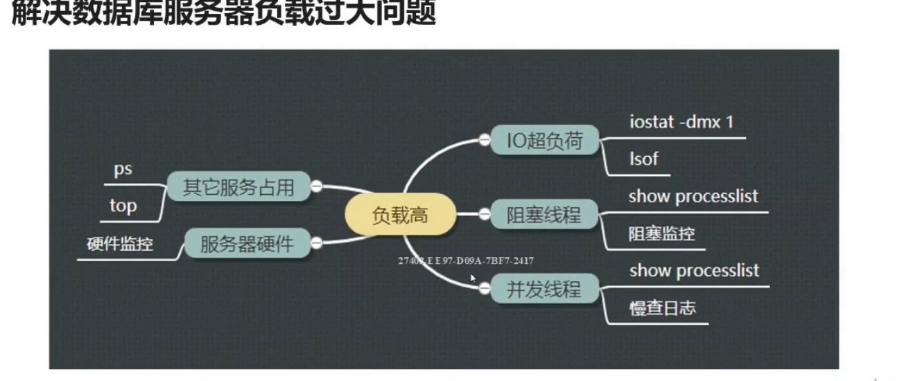
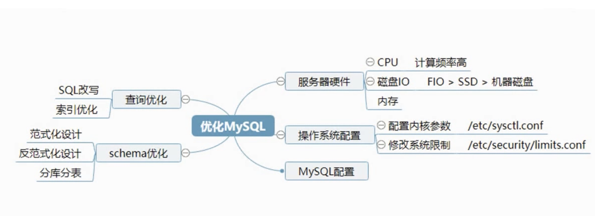
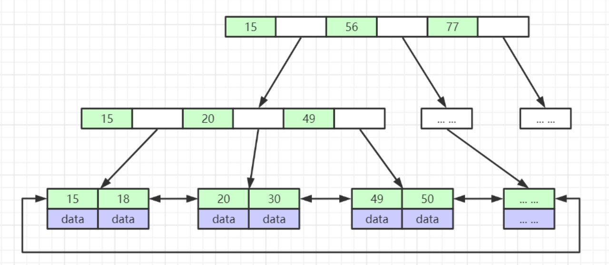

#  版本

常见的发行版本

官方社区版、  企业版、  percona Mysql、   MariaDB


升级可能带来的影响，sql_mode参数的变化

## 8.0新特性

服务器功能

1. 所有元数据使用InnoDB引擎存储，无frm文件
2. 系统表采用InnoDB存储并采用独立表空间（ibd文件）
3. 支持不可见索引和降序索引，支持直方图优化
4. 支持窗口函数
5. 支持在线修改全局参数持久化

用户及安全

1. 默认使用caching_sha2_password认证插件
2. 新增密码历史记录，限制重复使用密码
3. 新增支持定义角色

InnoDB功能

1. InnoDB DDL语句支持原子操作
2. 支持在线修改UNDO表空间
3. 新增innodb_dedicated_server配置

# 用户管理

**定义数据库账号**

 用户名@可访问控制列表

create user

**常用的用户权限**   Admin、DDL、DMl

为用户授权

grant select,instert,update on db.tb to user@ip;

revoke  insert on db.tb from user@ip;

**迁移数据库账号**

1. 导出用户建立及授权语句

pt-show-grant u=root,p=123456,h=localhost

2. 使用mysqlpump工具导出


# 服务器配置

读取mysql配置文件顺序的命令： mysqld --help --verbose | grep -A 1 'Default options'


mysql配置参数的根据作用域 的不同可以分为全局参数和会话参数

使用set命令配置动态参数

session 当前会话生效

global   全局生效（有的参数设置是在新的会话中生效 ），mysql服务重启后丢失

persist：生成mysql-auto.cnf配置文件（8.0版本后新增的）


**sql_mode** ：宽松、严格模式

only_full_group_by

ANSI_QUOTES 禁止用双引号引用字符串

REAL_AS_FLOAT

STRICT_TRANS_TABLES            启用严格模式

ERROR_ DIVISION_BY_ZERO  不允许0做除数


max_connections 		mysql允许访问的最大连接数

interactive_timeout  		设置交互时间的timeout时间

wait_timeout					设置非交互时间的timeout时间

max_allowed_packet		控制mysql可以接收的数据包大小（从服务器不能小于master的设置）

sync_binlog						表示每写多少次缓冲会向磁盘同步一次binlog（建议设为1）

sort_buffer_size     			每个会话使用的排序缓冲区大小

join_buffer_size                 每个会话使用的连接缓冲区大小

binlog_cache_size				每个会话用于缓存未提交的事务缓存大小


innodb_flush_log_at_trx_commit		设为1，每次事物提交都会刷新事务日志到磁盘

innodb_buffer_pool_size					设置innodb缓冲池的大小，应为系统可用内存的75%

innodb_buffer_pool_instances		innodb缓冲池实例个数

innodb_file_per_table						设置每个表使用一个独立表空间，on：独立表空间：tablename.ibd  off：系统表空间：ibdatax 

独立表空间和系统表空间如何选择

+ 系统表空间无法简单的收缩文件大小，独立表空间可以使用optimize table命令收缩系统文件
+ 系统表空间会产生IO瓶颈， 独立表空间可以同时向多个文件刷新数据

建议对innodb使用独立表空间


**innodb IO相关配置**

Innodb_log_file_size        控制单个事务日志 的大小

innodb_log_files_in_group    控制事务日志的个数

Innodb_doublewrite      建议设为1，开启双写缓存，增加数据的安全性


expire_logs_days  指定自动清理binlog日志的天数，以防止binlog占用太多空间，参数的设置应该最少覆盖两次全备的天数


使用**pt-config-diff**工具比较系统运行配置和配置文件中的配置

  pt-config-diff u=root,p= ,h=localhost    /etc/my.cnf


### 服务器硬件

CPU 64核 、内存512GB的主服务器。请求高峰时 qps 35W/s   、TPS  10W/s 、thread_run（并发数）700/s


# 日志

日志类型

**错误日志**（error_log）	记录mysql在启动、运行时出现的问题

log_error= $mysql/sql_log/mysql-error.log

Log_error_verbosity = [1,2,3].   1:error 2:error,warning	3:error,warning,note messages, 一般设为2

log_error_services=[日志服务组件；日志服务组件] 8.0版本后新增


**常规日志（general_log）**  记录所有发向mysql的请求，数据量庞大可能会对性能造成影响，记得关闭

general_log=[ON|OFF]

general_log_file

log_output  = [file|table|none]


**慢查日志（slow_query_log）**	记录符合条件的查询

slow_query_log = OFF

slow_query_log_file

long_query_time = x秒

log_queries_not_using_indexes = OFF

log_slow_admin_statements = OFF	记录慢管理语句 （add index之类）


**二进制日志（binary_log）**		记录全部有效的数据修改日志，用于主从复制，可以基于时间点备份恢复

log_bin = ON

log_bin_basename = $mysql/sql_log/mysql-bin

binlog_format  =[row|statement|mixed]		推荐使用row格式，statement记录的是修改语句，row记录的是语句执行后的结果

binlog_row_image = full｜minimal｜noblob  推荐使用 minimal

bingo_rows_query_log_events =ON	row格式下记录sql

查看binlog日志

mysqlbinlog  --no-defaults -vv --base64-output= DECODE-ROWS mysql-bin-file

**sync_binlog = 1 每一次写binlog日志都写入磁盘**

expire_logs_days= days  日志失效时间


**中继日志（relay_log）**			用于主从复制，临时存储从主库同步的二进制日志

relay_log = filename

relay_log_purge = ON		relay log 自动清理


**redo log**

Redo Log 保证了事务的持久性， Undo Log 保证了事务的原子性



**undo log**


## binlog和redolog的关系

**区别**

1. redo log是InnoDB引擎特有的；binlog是MySQL的Server层实现的，所有引擎都可以使用。
2. redo log是物理日志，记录的是“在某个数据页上做了什么修改”；binlog是逻辑日志，记录的是这个语句的原始逻辑，比如“给ID=2这一行的c字段加1 ”。
3. redo log是循环写的，空间固定会用完；binlog是可以追加写入的。“追加写”是指binlog文件写到一定大小后会切换到下一个，并不会覆盖以前的日志。

历史上的原因，binlog设计没有被用来做崩溃恢复（binlog可以关闭set sql_log_bin=0），binlog用于归档、主从复制，redolog用于crash-safe


# 存储引擎

## myisam

非事务性存储引擎

以堆表方式存储，叶子结点直接指向数据的物理地址，不需要回表，读操作比innodb快

使用表级锁

支持btree索引、空间索引、全文索引

支持数据压缩，使用mysiampack命令进行压缩，压缩表只能进行读操作


**适用场景**

非事务性应用

只读类应用

空间类应用。mysql5.7之前，mysiam是唯一支持空间函数的存储引擎

## csv

非事务性存储引擎

数据以CSV格式存储

所有列不能为null

不支持索引

使用场景：作为数据交换的中间表

## Archive

非事务性存储引擎

表数据使用zlib压缩

只支持insert和select

只允许在自增ID建立索引

使用场景：日志和数据采集类应用、数据归档存储

## memory

非事务性存储引擎

数据保存在内存中（数据易失）

所有字段长度固定

支持Btree和hash索引

使用场景：用于缓存字典映射表、缓存周期性分析数据

## Innodb

事务性存储引擎

支持行级锁及mvcc

数据按主键聚集存储

支持Btree和自适应Hash索引

支持全文和空间索引（5.6版本之后）

使用场景：大多数OLTP场景

**事务的实现方式**

原子性：回滚日志undo log 用于记录数据修改前的状态

一致性：重做日志redo log 用于记录数据修改后的状态

隔离性：共享锁+排它锁 用于资源隔离

持久性：redo log + undo log


# 主从复制



**同步复制**：保证了数据的强一致性、写性能低、可用性低

半同步复制、异步复制？：写性能高、可用性高，数据最终一致、可能会丢数据

**方案**：混合的复制方式，比如有一个master，一个同步复制的从副本，其他都是异步复制的从副本。

这样如果主副本故障，由于有一个同步复制的从副本，所以不会出现数据丢失的严重问题，并且这个从副本也能提供数据完全一致的读服务。另外其他从副本可能会读到旧版本数据，但是由于只有一个同步复制的从副本，对系统的写性能和可用性的影响也相对较少。


**master服务器上的操作**

开启binlog（必须）开启gtid（可选）

创建同步所用的数据库账号

使用master_data参数备份数据库

把备份文件传输到slave服务器

```sql
#主从都在192.168.1上
# my.cny
log_bin = on
gtid_mode = on
enforce-gtid-

server-id = 1

create user repl@'192.168.1.%' identified by '123456';
grant replication slave on *.* to repl@'192.168.1.%';

mysqldump --single-transaction -uroot  --master-date=2  --all-databases > master.sql
##scp将文件传到从库

```


**slave服务器上的操作**

开启binlog（可选） 开启gtid（可选）

恢复master上的备份数据库

使用change master配置链路

使用start slave启动复制

show slave status


**半同步复制需要安装扩展：semisync_master.so 	semisync_slave.so**


## 基于GTID和基于日志点复制

基于日志点复制使用场景：1.需要兼容老版本mysql及mariadb、2.需要使用MMM架构


**MMM和MHA高可用架构的作用**

对主从复制集群中的master的健康进行监控

当master宕机后把写VIP迁移到新的master

重新配置集群中的其他slave对新的master同步

## MMM

Multi-Master Replication Manager for MySQL，双主多从架构



需要的资源

主DB 2个，用于主备模式的主主复制配置

从DB 0-N个，可以配置0-n台从服务器

IP地址 2n+1个 ，N为mysql服务器的数量

监控用户，用于监控数据库状态的mysql用户（replication client）

代理用户，用于MMM的agent端哟哦你敢于改变read_only状态

复制用户，用于配置mysql复制的用户（replication slave）

**缺点**

故障切换简单粗暴易丢事务

社区不活跃

不支持gtid复制

现在基本不用

## MHA




故障转移步骤

1. 选举具有最新更新的slave
2. 尝试从宕机的master保存二进制日志
3. 应用差异的中继日志到其他slave
4. 应用从master保存的二进制日志
5. 提升选举的slave为新的master
6. 配置其他slave向新的master同步


**需要的资源**

主DB 1个

从DB 2-N

IP地址 n+2

监控用户

复制用户


**优点**

支持GTID和基于日志点的复制方式

可从多个slave中选举最适合的新master

会尝试从旧master中尽可能多的保存为同步日志

**缺点**

未必能获取到旧主未同步的日志（主备使用5.7以后的半同步复制可以大幅度减少数据丢失风险）

需要自行开发写VIP转移脚本

只监控master而没对slave实现高可用的办法

**适用场景** ：使用GTID的复制方式、使用一主多从的复制架构、希望更少的数据丢失场景


## 主从延迟

影响主从延迟的原因：执行大事务、网络传输速率、单线程复制

处理方式：

将大事务拆分成多个小事务、分批更新数据、

使用pt-online-schema-change工具进行DDL操作

减少单次事务处理的数据量以减少产生的日志文件大小（日志使用minimal row格式）

减少主上所同步的slave数量（一般不超过5个）

使用mysql5.7版本后的多线程复制

使用MGR复制架构

## MGR

Mysql Group Replication，是官方推出的一种基于Paxos协议的复制。是一种不同于异步复制的多Master复制集群



**优点**

 Group Replication组内成员间基本无延迟

可以支持多写操作，读写服务高可用

数据强一致，保证事务不丢失

**缺点**

只支持Innodb

单主模式下很难确认下一个primary

只能用于gtid模式复制，且日志格式必须为row

**适用场景**

对主从延迟十分敏感的应用场景

希望可以对读写提供高可用的场景

希望可以保证数据强一致的场景


读写负载

读负载：增加slave

写负载：分库分表


# 分库分表


## 问题

分布式事务问题

主键重复问题

跨节点查询，归并问题、排序问题


# 备份恢复

逻辑备份 ：转储sql语句，效率低，可移植性强

物理备份


全量备份 增量备份 差异备份

***常用备份工具***

## mysqldump

最常用的逻辑备份工具，支持全量备份及条件备份

mysqldump -uroot -p --where "count>20" dbname tbname  > dump01.sql  #条件备份

mysqldump -uroot -p --databases dbname  --master-data=2 --single- transaction > dump.sql  #备份

mysql -uroot -p  dbname  > dump.sql  #恢复

**优点**

备份结果为可读的sql文件，可用于跨平台跨版本恢复数据

备份文件的尺寸小于物理备份，便于长时间存储

mysql发行版自带工具，无需安装第三方软件

**缺点**

只能单线程执行备份恢复任务，备份恢复速度较慢

为完成一致性备份需要对备份表加锁，容易造成阻塞

会对innodb buffer pool造成污染

## mysqlpump

5.7版本引入，多线程逻辑备份工具，mysqldump的增强版本，速率有所提升


支持基于库和表的并行备份，可以提高逻辑备份的性能

支持使用zlib和lz4算法对备份进行压缩


基于表进行并行备份，对于大表来说性能较差

5.7.11之前版本不支持一致性并行备份

会对innodb buffer pool造成污染

## xtrabackup

innobackupex  --user=root --password=123456 /home/db_backup #生成文件目录 备份innodb相关配置、undo log、 xtrabackup

innobackupex --apply-log  /home/db_backup/时间戳文件目录   #恢复


percona提供的Innodb在线物理备份工具，

支持Innodb存储引擎在线热备份、对innodb缓冲没有影响

支持并行对数据库的全备和增量备份

备份和恢复速率比逻辑备份高


做单表恢复时比较复杂

完整的数据文件拷贝，所以备份文件比逻辑备份大

对跨平台和数据库版本的备份恢复支持度不如逻辑备份

## 备份应用

1. 逻辑备份 + 二进制日志 （mysqldump + binlog）

   mysqlbinlog   --start-position=position偏移点 mysql-bin.000002 > bd_diff.sql

   

2. 使用xtrabackup进行全量备份+增量备份

innobackupex  --user=root --password=123456 /home/db_backup   #全量备份

innobackupex  --user=root --password=123456 \           #增量备份（基于上一次的全备或增备）

​	-- incremental /home/db_backup \                               #本次备份所保存的目录

​	--incremental-basedir=/home/db_backup/back-dir  #本次备份基于上次备份所保存的目录


全备恢复

innobackupex --apply-log  --redo-only  全备目录 

innobackupex --apply-log  --redo-only  全备目录  --incremental-dir=第1-n次增量目录

innobackupex --apply-log  全备目录 

**最后一次增量备份后修改的数据只能通过binlog进行恢复**

使用mysqlbinlog命令在线实时备份

mysqlbinlog --raw --read-from-remote-server --stop-never --host 备份主机ip --port=3306 -u repl -p pwd  filename  

**repl具有replication slave权限**


# 监控

**性能类指标**

QPS			数据库每秒钟处理的请求数量

TPS			数据库每秒钟处理的事务数量，衡量数据库写操作程度，TPS<<QPS

并发数		数据库实例当前并行处理的会话数量，并发数>cup核数 说明当前mysql比较繁忙

连接数		连接到数据库会话的数量，大多数连接处于sleep状态,连接数>并发数，max_connections限制

缓存命中率	innodb的缓存命中率

**功能类指标**

可用性			mysql是否可以正常对外提供服务

阻塞				当前是否有阻塞的会话

死锁				当前事务是否产生了死锁

慢查询			实时慢查询

主从延迟		延迟时间

主从状态		主从复制链路是否正常

**QPS**

show   global status like 'Com%';    	#Com_update,更新计数器， 

show   global status like 'Queries';  	#QPS=（Queries2-Queries1）/ 时间间隔

**TPS**

show   global status where Variable_name in ('com_insert','com_delete','com_update');

Tc 约等于  com_insert + com_delete + com_update

TPS = （Tc2 - Tc1）/（time2-time1）


**并发数**

show global status like 'Threads_running';

**连接数**

show global status like 'Threads_connected';

报警阈值 Threads_connected / max_connections > 0.8


**Innodb缓存命中率**

Innodb_buffer_pool_read_requests ：从缓冲池中读取的次数 （总读取次数）

Innodb_buffer_pool_reads ：从物理磁盘读取的次数

(Innodb_buffer_pool_read_requests - Innodb_buffer_pool_reads ) / Innodb_buffer_pool_read_requests * 100%		#一般不小于90%

show global status like 'innodb_buffer_pool_read%';    


**可用性**

周期性连接数据库服务器并执行 select @@version;

Mysqladmin  -uroot -pxxx -hxxx ping   #mysqld is allive


**阻塞**

查询表 sys.innodb_lock_waits

```sql

select waiting_pid as '被阻塞的线程',
waiting_query as '被阻塞的sql',
blocking_pid as '阻塞线程',
wait_age as '阻塞sql',    #只能抓取正在执行的sql，执行完成不能抓去
sql_kill_blocking_query as '建议操作'
from sys.innodb_lock_waits
where (UNIX_TIMESTAMP() - UNIX_TIMESTAMP(wait_started)) > 30
```

**死锁**

- show engine innodb status	#查看最近一次死锁信息
- set global innodb_print_all_deadlocks = on  #将死锁信息写入错误日志
- pt-deadlock-logger #将死锁信息写入表中，信息已查看


**监控慢查询**

- 通过慢查询日志周期性监控

slow_query_log = ON

slow_query_log_file

- 通过information_schema.processlist 表实时监控

```sql
SELECT  * FROM  information_schema.processlist WHERE  time>10 and command !='sleep';
```

- 使用pt-query-digest分析慢sql


**监控主从延迟**

- show slave status		查看 Seconds_Behind_Master参数值，正在恢复的relay log与系统时间差值

- 更精细的监控方法  pt-hearbeat master创建一个线程后台周期性写入数据，slaver创建一个线程后台周期性读取数据


**监控主从状态**

show slave status		查看Slave_IO_Running、Slave_SQL_Running、last_error参数值


# 异常处理

**服务器过载**



IO超负荷：mysql输出大量日志、mysql正在进行大批量写、慢查询产生了大量磁盘临时表


**主从数据库数据不一致**

主从数据一致校验：checksum

可能原因：对从服务器进行了写操作、注入空事务、使用statement格式的复制

解决办法：设置 read_only=on、super_read_only、使用row格式的复制、使用pt_tabel_sync修复数据

**主服务器连不上**  

show slave status   Slave_IO_Running=connecting

- 主从服务器间网络是否畅通，使用ping命令
- 是否存在防火墙，过滤了数据库端口
- 复制链路配置的用户名密码、权限是否正确


**主键冲突**

show slave status   Slave_SQL_Running=no


**优化**



# 锁

**锁的主要作用是管理共享资源的并发访问，用于实现事务的隔离性**

全局锁：flush table with read lock

表级锁： 表锁  lock table   tablename  read/write    （解锁 unlock tables）

​                 元数据锁 MDL     ：访问表时自动加上，保证读写的正确性，

**如何安全地给小表加字段？**首先我们要解决长事务，事务不提交，就会一直占着MDL锁。比较理想的机制是，在alter table语句里面设定等待时间，如果在这个指定的等待时间里面能够拿到MDL写锁最好，拿不到也不要阻塞后面的业务语句，先放弃。之后开发人员或者DBA再通过重试命令重复这个过程。

**在InnoDB事务中，行锁是在需要的时候才加上的，但并不是不需要了就立刻释放，而是要等到事务结束时才释放。这个就是两阶段锁协议**

如果你的事务中需要锁多个行，要把最可能造成锁冲突、最可能影响并发度的锁尽量往后放。

主动死锁检测，innodb_deadlock_detect=on

读锁 写锁都是行级锁

## 共享锁（也称读锁）


## 独占锁（写锁、排他所）


索引


**redo log 主要节省的是随机写磁盘的IO消耗（转成顺序写），而change buffer主要节省的则是随机读磁盘的IO消耗。**


由于唯一索引用不上change buffer的优化机制，所以写操作比普通索引慢


按照效率排序的话，count(字段)<count(主键id)<count(1)≈count( * )，所以我建议你，尽量使用count(*)。

# 索引




**B+tree 与B-tree的区别**

非叶子节点不存储data，只存储索引(冗余)，可以放更多的索引

叶子节点包含所有索引字段

叶子节点用指针连接，提高区间访问的性能


innodb_page_size = 16KB，因为非叶子节点不存储data，每夜存放的索引更多


**为什么非主键索引结构叶子节点存放的是主键值** 为了节省空间、保持数据一致性


## 失效

1. 隐式类型转换
2. 被索引字段使用了表达式计算
3. 被索引字段使用了函数
4. 在like关键字后使用了左模糊匹配 '%xxx'
5. 被索引字段不是联合索引的最左字段


唯一索引，可以为空


# 分区

```sql
CREATE TABLE `t` (
  `id` int(11) NOT NULL AUTO_INCREMENT,
  `ftime` datetime NOT NULL,
  `c` int(11) DEFAULT NULL,
  PRIMARY KEY (`ftime`,`id`),
  KEY `id` (`id`)
) ENGINE=InnoDB DEFAULT CHARSET=latin1
PARTITION BY RANGE (YEAR(ftime))
(PARTITION p_2017 VALUES LESS THAN (2017) ENGINE = InnoDB,
 PARTITION p_2018 VALUES LESS THAN (2018) ENGINE = InnoDB,
 PARTITION p_2019 VALUES LESS THAN (2019) ENGINE = InnoDB,
 PARTITION p_others VALUES LESS THAN MAXVALUE ENGINE = InnoDB);
```


怎么给分区表t创建自增主键：由于MySQL要求主键包含所有的分区字段，所以肯定是要创建联合主键的。

**范围分区** 基于范围来分片容易产生热点问题

对查询非常友好，范围分片特别适合那种数据量非常大，但并发访问量不大的 ToB 系统

**hash分区**：比较容易把数据和查询均匀地分布到所有分片中

list分区


oneproxy工具


# 高效

**单表建议**

单表数据量尽量不超过5000w

单表物理大小不超过20G

索引不超过5个

单表不超过50个字段

优先使用utf8mb4字符集（兼容性好，例如支持emoji字符）

**实例建议**

总大小不超过500G

总表数量不超过5000个（包括分区）


**sql开发建议**

多表join连接时，关联字段的类型、长度、字符集保持一致，否则可能导致索引不可用（隐式类型转换）

多表join时，把过滤后结果集较小的表作为驱动表


MongoDB


# 集群

Replication集群方案：速度快、弱一致性、适合保存日志、新闻、帖子之类的低价值数据

PXC（Percona XtraDB Cluster）集群方案：速度慢、强一致性、适合保存订单、账户、财务之类的高价值数据


方案对比：

**PXC**中任何数据节点都是可读可写的，在任何mysql节点写入数据都会同步到其他的mysql节点；采用同步复制，事务在所有集群节点要么同时提交、要么不提交

**Replication**中数据同步是单向的，只有master节点可写；采用异步复制，无法保证数据的一致性


# 面试题

## 在什么情况下innodb无法在线修改表

加 全文索引、空间索引，删除主键、新增自增列、修改列类型的时候

在线DDL存在的问题：有的语句不支持在线DDL；长时间的DDL会引起严重的主从延迟 

**安全的执行DDL**

使用pt-online-schema-change 创建修改后的新表、拷贝数据、表重命名


## innodb读是否会阻塞写

不会，考察多版本并发控制


## 如何减小主从复制的延迟


## 说说你对MGR的认识


## 如何解决数据库读/写负载大的问题


分库分表的问题

全局唯一性ID保证


分布式事务
