redis是AP模型


# 应用场景

1. 缓存
2. 计数器
3. 分布式id生成
4. 海量数据统计  使用位图
5. 会话缓存
6. 队列/阻塞队列 lpush、 brpop实现阻塞队列
7. 分布式锁
8. 热点数据存储
9. 社交类需求，用户关系模型
10. 排行榜        使用 sorted set
11. 统计亿级日活        使用bitmap  ` setbit login_20230101  userid   1`     `bitcount login_20230101`

​		统计亿级日活连续登录    `bitop and login_20230101-02 login_20230101 login_20230102`   按位与运算结果存在 			   login_20230101-02

 	  统计亿级周活  `bitop or login_20230101week login_20230101 login_20230102 login_20230102`   按位与运算结果存在 

​		Bitmap底层数据存储为string，最大可达512MB （2^32）


# 底层数据结构

type  查看数据类型

object encoding 查看底层数据结构


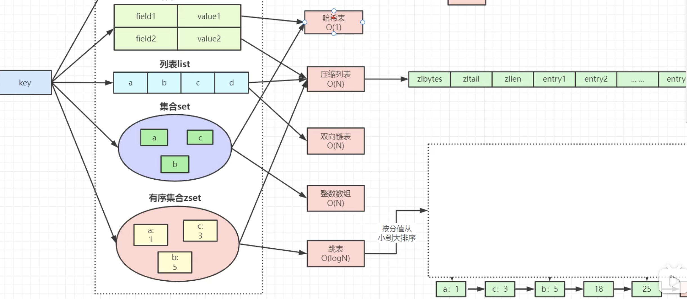


**string **

简单动态字符串SDS 底层数据结构有 int 、string、raw


**list**

List是一个有序(按加入的时序排序)的数据结构，Redis采用quicklist（双端链表） 和 ziplist 作为List的底层实现。

可以通过设置每个ziplist的最大容量，quicklist的数据压缩范围，提升数据存取效率

list-max-ziplist-size  -2        //  单个ziplist节点最大能存储  8kb  ,超过则进行分裂,将数据存储在新的ziplist节点中

list-compress-depth  1        //  0 代表所有节点，都不进行压缩，1， 代表从头节点往后走一个，尾节点往前走一个不用压缩，其他的全部压缩，2，3，4 ... 以此类推


压缩列表（ziplist）：类似一个数组、记录了偏移量


**hash**

Hash 数据结构底层实现为一个字典( dict ),也是RedisBb用来存储K-V的数据结构,当数据量比较小，或者单个元素比较小时，底层用ziplist存储，数据大小和元素数量阈值可以通过如下参数设置。 

```
hash-max-ziplist-entries  512    //  ziplist 元素个数超过 512 ，将改为hashtable编码 
hash-max-ziplist-value    64      //  单个元素大小超过 64 byte时，将改为hashtable编码
```


**set**


**zset**

跳表：给有序链表添加冗余的索引层，改为支持折半算法的数据结构

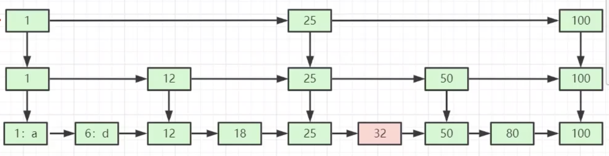


 # redis的单线程和高可用


redis的单线程主要是指redis的网络IO和键值对读写是由一个线程来完成的，这也是redis对外提供键值服务的主要流程。但redis的其他功能，比如持久化、异步删除、集群数据同步等，是由额外的线程执行的

**redis单线程为什么还能这么快？**

因为她所有数据都存在**内存**中，所有运算都是内存级别的运算。而且单线程避免了多线程的切换性能损耗问题。**利用epoll来实现IO多路复用**

## redis单线程如何处理并发客户端链接

NIO多路复用思想，利用epoll来实现IO多路复用，将连接信息和事件放到队列中，依次放到文件事件分派器，事件分派器将事件分发给事件处理器


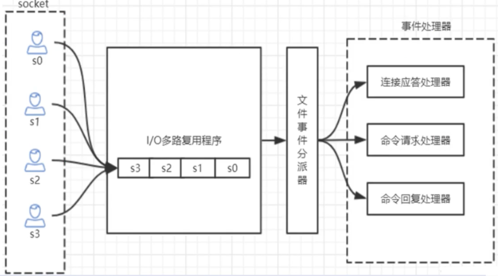


redis-benchmark  压测 10wqps


# redis lua脚本

 Redis在2.6推出了脚本功能，允许开发者使用Lua语言编写脚本传到Redis中执行。使用脚本的好处如下: 

1、减少网络开销：本来5次网络请求的操作，可以用一个请求完成，原先5次请求的逻辑放在redis服务器 上完成。使用脚本，减少了网络往返时延。这点跟管道类似。 

2、原子操作：Redis会将整个脚本作为一个整体执行，中间不会被其他命令插入。管道不是原子的，不过 redis的批量操作命令(类似mset)是原子的。

 3、替代redis的事务功能：redis自带的事务功能很鸡肋，而redis的lua脚本几乎实现了常规的事务功能， 官方推荐如果要使用redis的事务功能可以用redis lua替代。


# 持久化

## 快照 RDB


可以对 Redis 进行设置， 让它在“ N 秒内数据集至少有 M 个改动”这一条件被满足时， 自动保存一次 全量数据集。 比如说， 以下设置会让 Redis 在满足“ 60 秒内有至少有 1000 个键被改动”这一条件时， 自动保存一次 数据集：

save 60 1000   //关闭RDB只需要将所有的save保存策略注释掉即可


配置自动生成rdb文件后台使用的是bgsave方式（fork子进程异步执行，不会阻塞客户端命令），如果redis因为某些原因而故障停机，那么服务器将丢失最近写入仍未保存到快照中的数据 

**save与bgsave对比**

| 命令                  | save             | bgsave                                          |
| --------------------- | ---------------- | ----------------------------------------------- |
| IO类型                | 同步             | 异步                                            |
| 是否阻塞redis其他命令 | 是               | 否(在生成子进程执行调用fork函 数时会有短暂阻塞) |
| 复杂度                | O（n）           | O（n）                                          |
| 优点                  | 不会消耗额外内存 | 不阻塞客户端命令                                |
| 缺点                  | 阻塞客户端命令   | 需要fork子进程，消耗内存                        |


## 日志 AOF

原理是将Reids的操作日志以追加的方式写入文件，类似于MySQL的binlog

```
appendonly yes
appendfilename "appendonly.aof"

#多久将数据fsync到磁盘一次
appendfsync everysec  #每秒fsync一次，足够快，并且在故障时只会丢失一秒钟的数据。推荐配置，兼顾速度与安全性
appendfsync always  #每次有命令追加到AOF文件时就执行fsync命令，非常安全也非常慢
appendfsync no  #从不fsync，将数据交给操作系统来处理。更快也更不安全的选择


#优化配置aof重写，例如incr count 6次操作，直接重写成 set count 6
auto-aof-rewrite-percentage 100  #文件自上一次重写后文件大小增长100%则再次触发重写
auto-aof-rewrite-min-size 64mb #文件超过64m，进行重写

#进入redis客户端执行命令bgrewriteaof可以手动重写aof
```


| 命令       | RDB        | AOF            |
| ---------- | ---------- | -------------- |
| 启动优先级 | 低         | 高             |
| 体积       | 小         | 大             |
| 恢复速度   | 快         | 慢（重放命令） |
| 数据安全性 | 容易丢数据 | 根据策略决定   |

生产环境可以都启用，redis启动时如果既有rdb文件又有aof文件则优先选择aof文件恢复数据，因为aof一般来说数据更全一点


## 混合持久化

重启 Redis 时，我们很少使用 RDB来恢复内存状态，因为会丢失大量数据。我们通常使用 AOF 日志重 放，但是重放 AOF 日志性能相对 RDB来说要慢很多，这样在 Redis 实例很大的情况下，启动需要花费很 长的时间。 Redis 4.0 为了解决这个问题，带来了一个新的持久化选项——混合持久化。 通过如下配置可以开启混合持久化(必须先开启aof)


aof重写时不再是单纯的将resp命令写入文件中，而是将重写前的内存做rdb快照处理，并且将rdb快照内容和增量的aof命令存放在一起。

于是在redis重启时，可以先加载rdb内容，再重放增量aof日志。这样可以完全替代之前的aof全量文件重放，重启效率得到大幅提升

```
aof-use-rdb-preamble yes  #必须先开启aof
```


# 主从架构

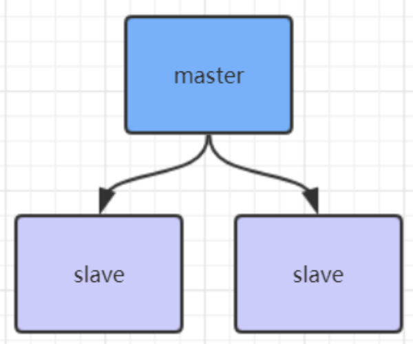


## 主从架构作用

- 数据冗余:主从复制实现了数据的热备份，是持久化之外的一种数据冗余方式。
- 故障恢复:当主节点出现问题时，可以由从节点提供服务，实现快速的故障恢复;实际上是一种服务的冗余。   

- 负载均衡:在主从复制的基础.上，配合读写分离，可以让主节点提供写服务，由从节点提供读服务〈即写Redis数据时应用连接主节点，读Redis数据时应用连接从节点)，分担服务器负载;尤其是在写少读多的场景下，通过多个从节点分担读负载，可以大大提高Redis服务器的并发量。

  - 高可用基石:除了上述作用以外，主从复制还是哨兵和集群能够实施的基础,因此说主从复制是Redis高可用的基础。


配置从节点只读

```
1、复制一份redis.conf文件

2、将相关配置修改为如下值：
 port 6380
 pidfile /var/run/redis_6380.pid # 把pid进程号写入pidfile配置的文件
 logfile "6380.log"
 dir /usr/local/redis‐5.0.3/data/6380 # 指定数据存放目录
 # 需要注释掉bind
 # bind 127.0.0.1（bind绑定的是自己机器网卡的ip，如果有多块网卡可以配多个ip，代表允许客户端通
 过机器的哪些网卡ip去访问，内网一般可以不配置bind，注释掉即可）

 3、配置主从复制（最关键的配置）
 replicaof 192.168.0.60 6379 # 从本机6379的redis实例复制数据，Redis 5.0之前使用slaveof
 replica‐read‐only yes # 配置从节点只读

 4、启动从节点
 redis‐server redis.conf

 5、连接从节点
 redis‐cli ‐p 6380

 6、测试在6379实例上写数据，6380实例是否能及时同步新修改数据

 7、可以自己再配置一个6381的从节点
```


## 主从工作原理

如果你为master配置了一个slave，不管这个slave是否是第一次连接上Master，它都会发送一个PSYNC 命令给master请求复制数据。 

master收到PSYNC命令后，会在后台进行数据持久化通过bgsave生成最新的rdb快照文件，持久化期 间，master会继续接收客户端的请求，它会把这些可能修改数据集的请求缓存在内存中。当持久化进行完 毕以后，master会把这份rdb文件数据集发送给slave，slave会把接收到的数据进行持久化生成rdb，然后 再加载到内存中。然后，master再将之前缓存在内存中的命令发送给slave。

 当master与slave之间的连接由于某些原因而断开时，slave能够自动重连Master，如果master收到了多 个slave并发连接请求，它只会进行一次持久化，而不是一个连接一次，然后再把这一份持久化的数据发送 给多个并发连接的slave。


**主从复制(全量复制)流程图：**

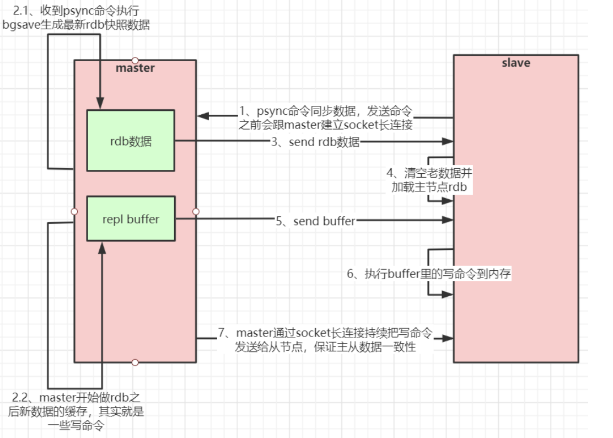


**数据部分复制**

master会在其内存中创建一个复制数据用的缓存队列，缓存最近一段时间的数据，master和它所有的 slave都维护了复制的数据下标offset和master的进程id，因此，当网络连接断开后，slave会请求master 继续进行未完成的复制，从所记录的数据下标开始。如果master进程id变化了，或者从节点数据下标 offset太旧，已经不在master的缓存队列里了，那么将会进行一次全量数据的复制。 流程图如下：

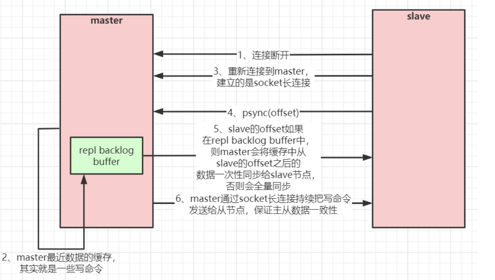


## 问题

**主从同步为什么用rdb而不用aof**

因为用rdb恢复更快

**关闭rdb会对主从复制造成什么影响？**

主从复制中send的rdb数据，是redis服务端自己做的，和redis配置文件中是否开启sava（rdb）没有任何关系


**slave不设置 replica‐read‐only yes （ 配置从节点只读）会有什么影响？**


## 主从复制风暴

如果有很多从节点，为了缓解主从复制风暴(多个从节点同时复制主节点导致主节点压力过大)，可以做如 下架构，让部分从节点与从节点(与主节点同步)同步数据

```
replicaof slave_ip slave_port # 从slave实例复制数据，
```


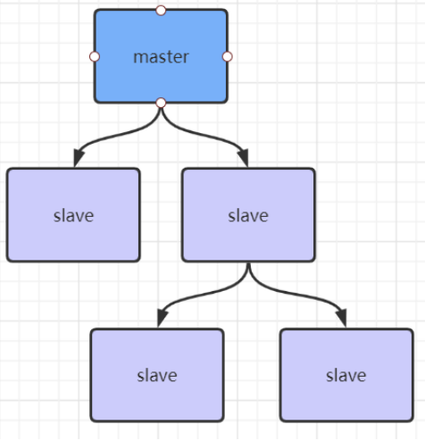


# 哨兵架构

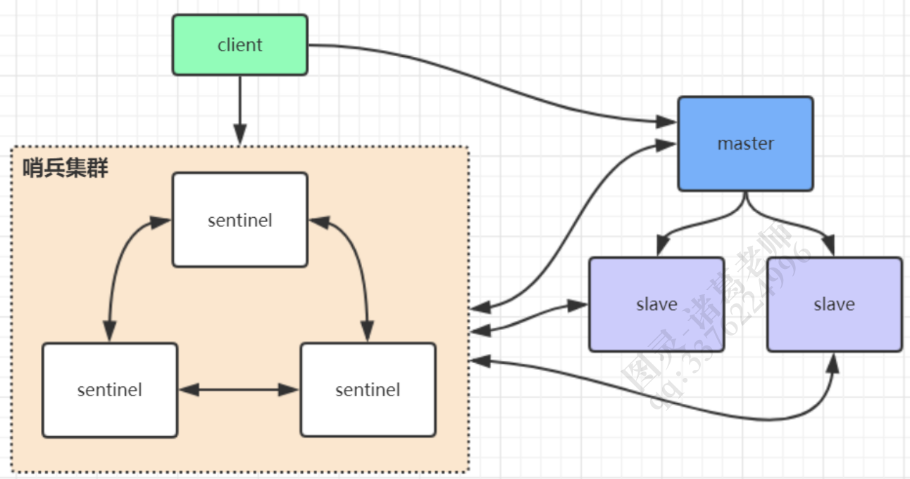

单纯的主从架构，从节点只是做备份和提供读操作 ，如果主节点发生故障宕机，需要运维手动操作


sentinel哨兵是特殊的redis服务，不提供读写服务，主要用来监控redis实例节点。 

哨兵架构下client端第一次从哨兵找出redis的主节点，后续就直接访问redis的主节点，不会每次都通过 sentinel代理访问redis的主节点，当redis的主节点发生变化，哨兵会第一时间感知到，并且将新的redis 主节点通知给client端(这里面redis的client端一般都实现了订阅功能，订阅sentinel发布的节点变动消息) 

**redis哨兵架构搭建步骤：**

```
 1、复制一份sentinel.conf文件
 cp sentinel.conf sentinel‐26379.conf

 2、将相关配置修改为如下值：
 port 26379
 daemonize yes
 pidfile "/var/run/redis‐sentinel‐26379.pid"
 logfile "26379.log"
 dir "/usr/local/redis‐5.0.3/data"
 # sentinel monitor <master‐redis‐name> <master‐redis‐ip> <master‐redis‐port> <quorum>
 # quorum是一个数字，指明当有多少个sentinel认为一个master失效时(值一般为：sentinel总数/2 +1)，master才算真正失效
 #sentinel monitor mymaster 192.168.0.60 6379 2 # mymaster这个名字随便取，客户端访问时会用到

 3、启动sentinel哨兵实例
 src/redis‐sentinel sentinel‐26379.conf

 4、查看sentinel的info信息
 src/redis‐cli ‐p 26379
 127.0.0.1:26379>info
 可以看到Sentinel的info里已经识别出了redis的主从

 5、可以自己再配置两个sentinel，端口26380和26381，注意上述配置文件里的对应数字都要修改
```

sentinel集群都启动完毕后，会将哨兵集群的元数据信息写入所有sentinel的配置文件里去(追加在文件的 最下面)，我们查看下如下配置文件sentinel-26379.conf，如下所示：

```
sentinel known‐replica mymaster 192.168.0.60 6380 #代表redis主节点的从节点信息
sentinel known‐replica mymaster 192.168.0.60 6381 #代表redis主节点的从节点信息
sentinel known‐sentinel mymaster 192.168.0.60 26380 52d0a5d70c1f90475b4fc03b6ce7c3c56935760f #代表感知到的其它哨兵   节点
sentinel known‐sentinel mymaster 192.168.0.60 26381 e9f530d3882f8043f76ebb8e1686438ba8bd5ca6 #代表感知到的其它哨兵   节点
```


# 高可用集群redis cluster

redis集群是一个由**多个主从节点群组成的分布式服务器群**，它具有**复制、高可用和分片**特性。redis集群不需要sentinel哨兵也能完成节点移除和故障转移的功能。需要将每个节点设置成集群模式，这种集群模式没有中心节点，可水平扩容（官方推荐不超过1000个节点）。redis集群的性能和高可用性均优于哨兵模式


## 高可用集群模式

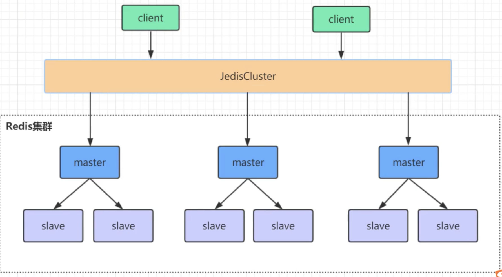


## 集群重要配置

```
cluster-enabled yes  #开启集群模式
cluster-config-file  nodes-port.conf  #集群节点信息文件，port是服务端口号
cluster-node-timeout  5000   #节点超时时间
appendonly  yes

requirepass   passwd  #设置redis访问密码
masterauth  	passwd	#设置集群节点访问密码，跟上面一致
```

## 命令

create	创建集群 host1:port1 ... host n:port n

add-node		将一个节点添加到集群，第一个参数为新添加的节点host：port，第二个参数为集群任意已存在节点的host：port

del-node  	移除节点

reshard		重新分片

check		检查集群状态


## 水平扩容操作

现有节点8001，新增两个节点 8007、8008，8007作为8008的master

1、将节点添加到集群

`/usr/local/redis-5.0/src/edis-cli -a passwd --cluster add-node 192.186.0.60 8007 192.186.0.60 8001`

`/usr/local/redis-5.0/src/edis-cli -a passwd --cluster add-node 192.186.0.60 8008 192.186.0.60 8001`


2、使用redis-cli命令为8007分配槽位，找到集群中的任意一个主节点，对其进行重新分片工作，均匀的从其他n个主节点中分配槽位

`/usr/local/redis-5.0/src/edis-cli -a passwd --cluster reshard 192.186.0.60 8001`

**注意** add-node水平扩容后要使用reshard分配槽位到新节点，分配槽位对应的数据也会迁移到新节点


3、任何节点新加入集群状态都是master，现在将8008设置成8007的slave。

进入8008客户端执行命令

`192.186.0.60:8008> cluster replicate 8007唯一id `      # 8007唯一id 可根据客户端命令cluster nodes获取


## 高可用集群与哨兵架构的比较

1、哨兵选举切换主从节点的时候会有几秒到几十秒无法访问，集群部分解决了访问瞬断问题（其中一个小集群出现故障，还有其他小集群提供服务，如果hash定位算法定位到故障集群依然会有上述问题）

2、哨兵架构对外提供写的节点只有一个，而redis单节点，最高10w qps，对于高并发场景捉襟见肘。

3、单节点不宜配太多内存，一般8～10G（否则会导致持久化文件过大，影响数据恢复或主从同步的效率）。这导致了哨兵架构的限制。集群架构的数据是分片放的（几个小集群数据是不重叠的）

例：如果需要缓存1T数据，可以使用110个节点，每个节点存10G

4、集群读写都走主节点，不支持对从节点的读操作，做备份用。哨兵架构从节点可读


## 集群原理分析

redis cluster将所有数据划分为16384个slots（槽位），每个节点负责其中一部分槽位，槽位的信息存储于每个节点中。

当redis cluster的客户端来连接集群时，它也会得到一份集群的槽位信息并将其缓存在客户端本地，这样当客户端要查找某个key时，可以直接定位到目标节点。同时因为槽位的信息可能会存在客户端与服务器不一致的情况，还需要纠正机制来实现槽位信息的校验调整。

**槽位定位算法**

cluster默认会对key值使用crc16算法进行hash得到一个整数值，然后用这个整数值对16384进行取模来得到具体槽位。

` hash_slot =crc16(key) mod 16384`


**跳转重定向**

当客户端向一个错误的节点发出了指令，该节点会发现指令的key所在的槽位并不归自己管理，这时它会向客户端发送一个特殊的跳转指令携带目标操作的节点地址，告诉客户端去连这个节点获取数据，客户端收到指令跳转到正确的节点，并同步更新纠正本地的槽位映射表缓存，后续所有key将使用新的槽位映射表


### 集群节点间的通信机制

redis cluster节点间采取gossip协议进行通信

- 维护集群的元数据（集群节点信息、主从角色、节点数量、各节点共享的数据等）有两种方式：集中式和gossip

**集中式**

优点在于元数据的更新和读取，实效性非常好，一旦元数据出现变更立即就会更新到集中式的存储中，其他节点读取的时候就可以立即感知到；不足在于所有的元数据的更新压力全部集中在一个地方，可能导致元数据的存储压力。很多中间件都会借助zookeeper集中式存储元数据。


**gossip**

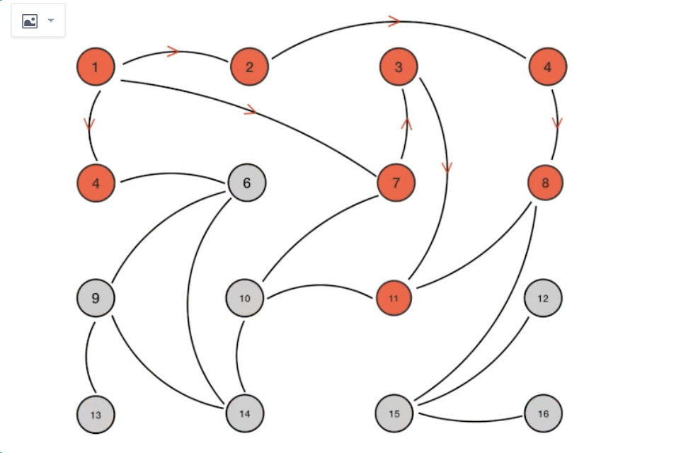

gossip协议包含多种消息，包括ping、pong、meet、fail等

gossip协议的优点在于元数据的更新比较分散，不是集中在一个地方，更新请求会陆陆续续，打到所有节点上去更新，有一定的延时，降低了压力；缺点在于元数据更新有延时可能导致集群的一些操作会有一些滞后。


**gossip通信端口**

每个节点都有一个专门用于节点间通信的端口，就是自己提供服务的端口号+10000。比如6379，那么用于节点间通信的就是16379端口。每个节点每隔一段时间都会往另外几个节点发送ping消息，同时其他几个节点收到ping消息后返回pong消息。


### 网络抖动

网络突然之间部分连接不可访问，然后很快恢复正常。

为解决这种问题，redis提供了一种选项`cluster-node-timeout`,表示当节点持续timeout的时间失联后，才可以认定该节点出现故障，需要进行主从切换。一般配置5秒钟。时间配置很短的话，可能导致主从频繁切换。


### 集群选举原理分析

当slave发现自己的master变为fail状态时，便尝试进行failover，以期成为新的master。由于挂掉的master可能会有多个slave，从而存在多个slave竞争成为master节点的过程。其过程如下：

1. slave发现自己的master变为fail
2. 将自己记录的集群currentEpoch加1，并广播failover_auth_request信息
3. 其他节点收到该信息，只有master相应，判断请求者的合法性，并发送failover_auth_ack，对每一个epoch只发送一次ack
4. 尝试failover的slave收集master返回的failover_auth_ack
5. slave收到**超过半数master的ack**后变成新的master（这里解释了集群为什么至少需要三个主节点，如果只有两个，当其中一个挂了，只剩一个主节点是不能选举成功的）
6. slave广播ping消息通知其他集群节点


从节点并不是在主节点进入fail状态就马上尝试发起选举，而是有一定的延迟，一定的延迟确保我们等待fail状态在集群中传播。slave如果立即尝试选举，其他master或许尚未意识到fail状态，可能会拒绝投票。`delay = 500ms + random(0-500ms) + slave_rank*1000ms`


票数一样时会进入下一轮选举。


## 集群脑裂数据丢失问题

redis集群没有过半机制，网络分区导致脑裂后多个主节点对外提供的服务（主节点和其他从节点网络不通，过了超时时间会发起一轮新的选举，此时一个集群节点有了两个主节点）。一旦网络分区恢复，会将其中一个主节点变为从节点，这时会有大量数据丢失。

规避方法可以在redis配置里加上参数（这种方法不能百分百避免数据丢失，参考集群leader选举机制）

```
min-slaves-to-write 1 //写数据成功最少同步的slave数量，这个数量可以模仿大于半数机制配置，比如集群总共三个节点可以配置1，加上		                       //leader就是2，超过了半数
```

**注意** 这个配置在一定程度上会影响集群的可用性，比如slave要是少于1个，这个集群就算leader正常也不能提供服务了，需要具体场景权衡选择


## 集群是否完整才能对外提供服务


## 集群为什么至少需要三个master节点，并且推荐节点数为奇数

因为新master的选举需要大于半数的集群master节点同意才能选举成功，如果只有两个master节点，当其中一个挂了，是达不到选举新master的条件的


## 集群对批量操作命令的支持

类似mset、mget批量操作命令具有原子性，redis集群只支持所有所有key落在同一个slot的情况，如果有多个key一定要用mset命令在集群上操作，则可以在key的前面加上{xx}，这样参数数据分片hash计算的只会是大括号里的值，这样能确保不同的key能落到同一个slot里

示例：`mset {user1}:name zs {user1}:age 18`


# 特点

性能高的原因

epoll多路复用

单线程

底层数据结构

object encoding key 


## 缓存与数据库双写不一致

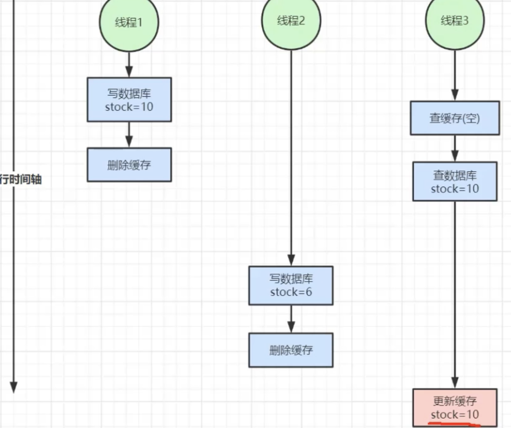


方案1: 线程2、3更新数据之前加分布式锁（并行变串行）

方案2:加读写锁（读多写少的场景）


# 分布式锁

锁的定义：锁是操作系统的基于原语，它是用于并发控制的，能够确保在多 CPU 、多个线程的环境中，某一个时间点上，只能有一个线程进入临界区代码，从而保证临界区中操作数据的一致性。

特性：**互斥** ：即保证不同节点、不同线程的互斥访问；

**超时机制** 即超时设置，防止死锁（避免获得锁的节点长时间执行，还未执行完，锁就释放的问题，可以在每一次成功获得锁的时候，为锁设置一个超时时间，获得锁的节点与锁服务保持心跳，锁服务每一次收到心跳，就延长锁的超时时间），分布式锁才有这个特性  ；

**公平性** 

对于在共享存储中写入数据等等，完全不能容忍分布式锁互斥语义失败的情况，不应该借助分布式锁从外部来实现，而是应该在共享存储内部来解决。比如，在数据库的实现中，隔离性就是专门来解决这个问题的。**分布式锁的设计，应该多关注高可用与性能，以及怎么提高正确性，而不是追求绝对的正确性**。


### 实现

减库存场景，解决超卖问题

最简单的实现

```
try{
  redis.setnx(key,val,expire)    //set lock_product_1001 1 nx ex 10,加失效时间是防止代码中途崩溃导致锁没有删除
  //code
  
}finally{
	redis.del(key)
}

//可能出现的问题，1执行code时系统宕机，2key过期之后执行del，导致锁失效
```


**锁失效问题**：高并发场景下线程1加锁成功，失效时间设置10S，但是code执行需要15s，在10s时所以自动删除，此时线程2加锁成功。第15s时线程1执行del(key)实际上删除的时线程2的锁

优化

```
try{
	clientId = UUID.randomUUID() 		//给每一个客户端设置一个唯一ID
  redis.setnx(key,clientId,expire)    
  //code
  
}finally{
	if(clientId == redis.get(key))	//谁加锁谁释放
	redis.del(key)					
}


```


进一步优化，**锁续命**：在后台开启一个新的线程，开一个定时任务，每隔3s（超时时间的1/3）检查锁，如果存在重新设置超时时间（10s）。如果锁不存在，直接结束线程 


更好的实现，参考redisson，两个优化

1、使用lua脚本，保证命令执行的原子性

2、使用锁续命机制，即新开一个线程，定时任务检测所是否存在，若存在重新设置expire（定时任务间隔时间<expire）


```
//使用redisson实现分布式锁
redissonLock = redisson.getlock(key)
try{
	 redissonLock.lock()  	//加锁，实现锁续命功能
  //code
  
}finally{
	redissonLock.unlock()					
}


```


### 锁丢失问题

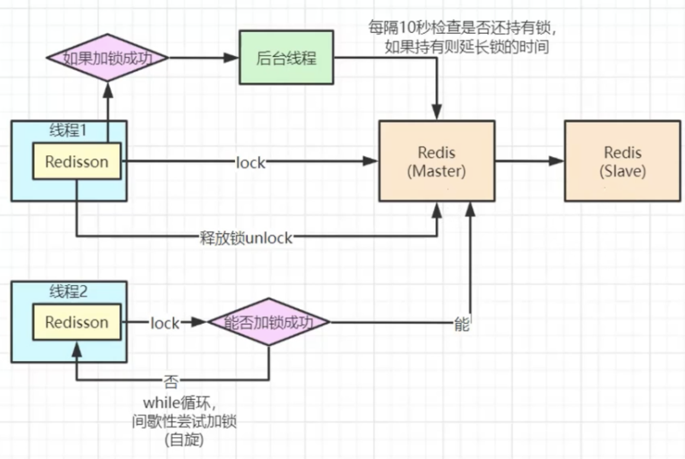


当redis master向slave同步的过程中宕机了，锁信息未同步到slave中，slave成了新的master，此时新的线程可以加锁执行，导致了并发安全问题。这种问题一般可以容忍（记录日志）。也可以使用zookeeper


分布式锁类型

redis：**AP模型，高性能**，主节点写入成功即可，会导致锁丢失问题

zookeeper：**CP模型，数据一致**，与redis架构的区别是，节点必须大于三，往主节点写入key，会同步子节点，超过半数写成功，才返回成功。不会有锁丢失问题

RedLock：超过半数redis节点加锁成功才算加锁成功


### 提升并发

**分段加锁（锁粒度）**

lock_stock_id     分段成lock_stock_id_1  lock_stock_id_2   lock_stock_id_3  

